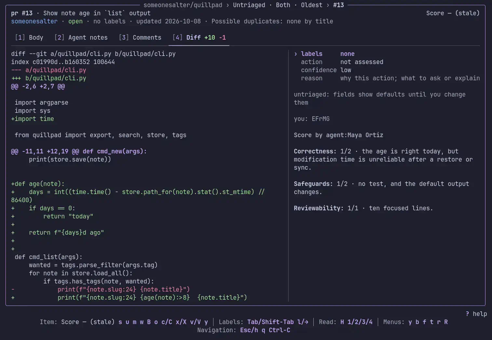
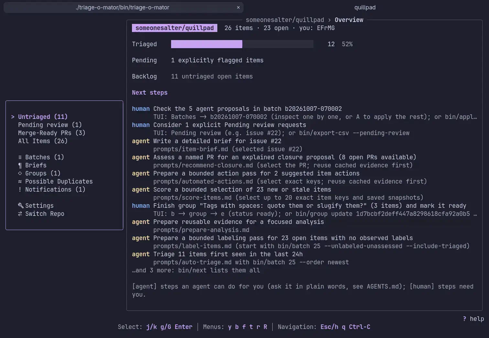
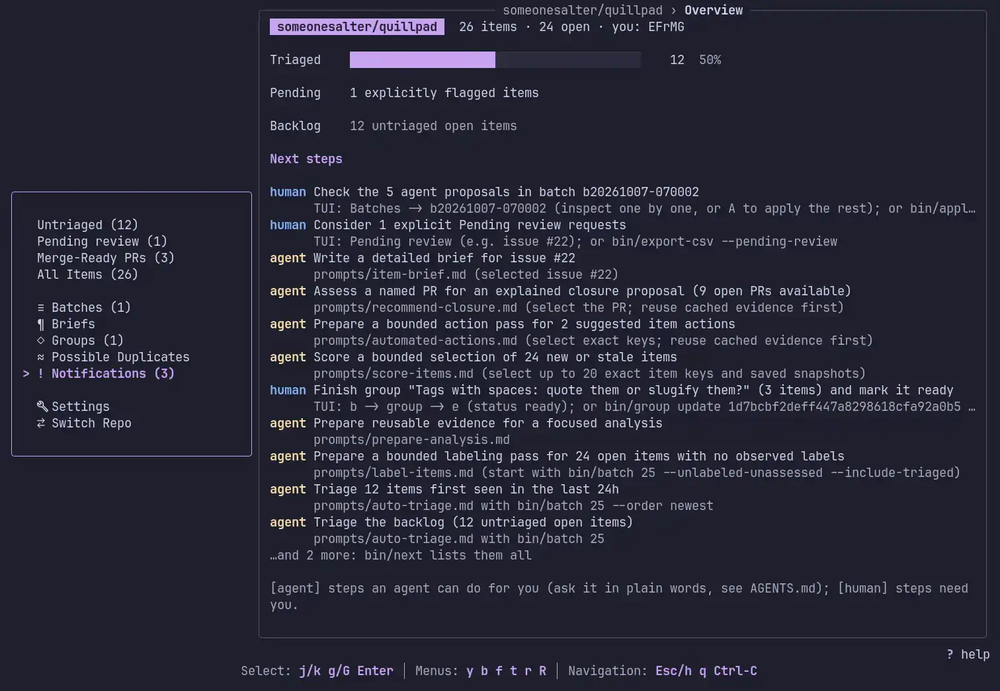
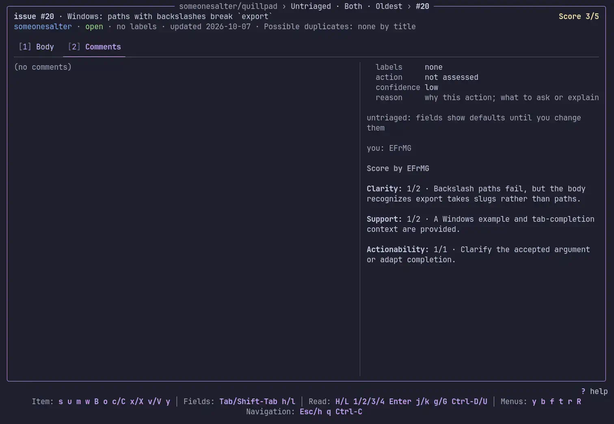

# _triage-o-mator_: a first pass through the backlog, without losing the human

**A terminal tool for maintainers and the contributors they trust, facing thousands of open Issues and Pull Requests.** It installs into the repository you triage, organizes a first pass in small batches **—** by a person or an AI agent **—** and keeps local decisions reviewable in git. Agent proposals, human review and GitHub actions each have their own step.

> [!IMPORTANT]
> Machines propose while humans decide.

This is how a less technical README I dislike reading would read, which given that I make myself no favors by excluding such I had to write.











## The problem

Popular open source projects collect Issues and PRs faster than anyone can read them.

[omacom/omarchy](https://github.com/omacom/omarchy) inspired the tool. At the scale of a busy backlog, nobody reads every item from the start. Duplicates pile up, good PRs go stale, and contributors wait for a first response.

The usual fixes fall short:

- **Bots that label and close automatically** act on a live repo without anyone checking them first. One wrong "duplicate, closing" erodes contributor trust quickly.
- **Asking an AI to "triage the repo"** gives answers nobody can audit, spread across chat logs, lost and forgotten.
- **Spreadsheets and ad-hoc scripts** don't hold up past a few hundred items!

## Where the work lives

You clone and build _triage-o-mator_ once, then install it into each repository you triage in a single command.

That creates one `triage-o-mator/` directory inside that repository, and it's as simple as it sounds: its ledger, its review groups, its closure proposals, its reports and its taxonomy, with the program itself symlinked back to your checkout of its very own repo. Reviewed local work can travel through an ordinary pull request that a maintainer reads line by line; with no new place to look, no separate service, no database. Batches and evidence caches stay local.

A repository you don't control can carry the install locally instead using `--solo` (one line in `.git/info/exclude`), not a single tracked file touched, and adopt it later with `--adopt` once they recognize your triage-ability, which stages everything ready for the pull request that says **"we use this now."**

## Design principles

1. **Separate reading from writing.** Backlog acquisition reads GitHub. Publishing a comment, closing or reopening an item needs explicit approval of the exact target, text and state change; triage decisions never trigger these writes. A separate bounded pass may apply proposed labels after previewing the exact additions and removals, unless it is turned off for the repository. The tool does not merge.
2. **Proposals and reviews are separate states.** A decision is first _triaged_ (by an agent or a person) and then _reviewed_ (only by a person). Nothing crosses that line by itself.
3. **One ledger per repo, tracked in git.** `triage-o-mator/data/<owner>/<repo>/ledger.jsonl`, one JSON line per item, inside the repository it describes, so every decision and every correction shows up as a normal diff.
4. **Scripts underneath, a TUI on top.** Scripts own the ledger, groups, proposals, evidence and GitHub writes. The TUI calls those same scripts, which agents and people can also use directly.
5. **Team-owned vocabulary.** Proposed labels come from the repository's own GitHub label catalog; actions and confidence levels come from a small, documented taxonomy that each team owns and edits. Neither human nor clanky model invents one on the fly.

## Main features

### A terminal UI built for reading, not skimming

_triage-o-mator_ is a [Bubble Tea](https://github.com/charmbracelet/bubbletea) app over the ledger:

- **Lists in the sidebar:** Untriaged—with kind and age-order controls—Merge-Ready PRs and All Items, then Batches, **Groups**, Possible Duplicates and Notifications. Review saved calls in All Items; prepare and review exact actions in Notifications.
- **A full-screen reader** with Body, Agent notes, Comments and Diff tabs.
- **A decision form** whose labels are picked from the repository's GitHub catalog and whose action and confidence cycle through the taxonomy's exact values; with a one-sentence reason for free text.
- **Unsaved drafts per item** for the session, so you can compare several reports before deciding; switching repositories warns about those drafts.
- A footer showing available controls, a breadcrumb showing location, full command output for failures, and bundled or custom themes.

What more could you even expect these days?

### Batches, from the TUI or command line

The core loop is a **batch**: a manageable number of untriaged items (25 is a good size), fetched with their full bodies and comments. Even an Agent could process this without blowing its virtual brains out.

- Create batches by size, kind, order and group.
- Each batch shows its progress, and decisions saved inside it are hot-iron stamped with its ID.
- When an **AI agent has filled one in**, its proposals show in the list and prefill the form. Review them one at a time, or apply the rest as unreviewed agent decisions. Applying never overwrites a decision someone else already saved.

### Duplicate detection that points you to the other item

Duplicates are the most common and the riskiest call to get wrong. _triage-o-mator_ finds likely candidates and leaves the verdict to the reader.

- Our super-performant **`bin/similar`** ranks items by title similarity **offline** on the local ledger, weighting rare terms far above common ones.
- **A Possible Duplicates view** lists every likely pair. You would be surprised with how many of the most common have identical titles!
- **"Not duplicates" is a durable verdict.** Rule a pair out and it stays out, recorded in git, so nobody re-litigates it next week.
- **Batches carry the candidates too**, so an Agent can name a duplicate it would otherwise never have seen, and a dedicated, Agentic playbook compares the full bodies and comments of an item and its candidates.

Overall, scores are presented as leads instead of proof.

### Review groups for team handoffs

Related issues and PRs often need to be read together: a bug report, its duplicates, and two competing fixes. **Groups** hold them with a description, an assignee, a draft / ready / archived status, per-item notes, and who contributed what.

- Add items from anywhere, browse members, open any for full context.
- Export **Markdown or JSON review packets** with current decisions and cross-references, optionally enriched with selected bodies, comments and diffs, to hand to a co-maintainer. A reviewed group can hand selected members back to an agent for a focused proposal.
- Group files are written atomically under a lock and protected by revision checks, so a stale edit is rejected instead of silently overwriting someone else's.

### Fetching that keeps up with a busy repo

- **Incremental by default:** changed items can be fetched without rereading the whole backlog. It is so fast, I couldn't even finish this sen.
- **Full fetches** run automagically when the next fetch finds the last full one is over a day old. They catch deleted or transferred items that an incremental fetch cannot see.
- **A local dataset** can freeze the open backlog and download descriptions, discussions, PR files, diffs and closing links for offline analysis. Automatic download starts only when you turn it on; saved checkpoints let it resume, while missing or old evidence stays visible.

### Agents as collaborators, not authorities

- **A core playbook ships with the install** becoming that install's `AGENTS.md` for the tool, and without disturbing yours. All Agents are supported.
- **One playbook per task:** triage a batch, check duplicates, review a PR's code, organize groups, recommend a PR closure, review an appeal, make a report decision-ready, and brief the maintainers. Ask in plain words and the Agent will pick the right one for you.
- **The code is right there.** Because the install sits inside the repository, an agent reviewing a PR reads the actual files to check broader context and whether a fix already landed.
- **The TUI hands a screen to an agent.** Item context, ticked items, or a batch with its file paths can be copied as Markdown for a chat.

### A feedback loop before anything reaches GitHub

An agent can read a named PR, current human guidance, earlier objections and selected evidence, then explain why it should stay open or save a proposed closure with the exact comment. The proposal is a reviewable local record, not a GitHub action.

**Notifications** puts that comment beside its target, guidance and evidence gaps. A person can edit it, reject it with an optional attributed reason, or approve the exact comment and close action. An edit needs fresh review; a rejection remains for the next agent pass, where reconsideration must explain what changed. Group readiness and a reviewed ledger decision do not grant publication approval.

People can also compose comments and explained closures or reopenings directly. `bin/comment-plus` defaults to a dry-run plan, checks the live target before publication, and saves separate comment and state-change outcomes so an uncertain result can be inspected before retrying. Nothing labels, approves or merges a PR.

Tracked comments appear in Notifications. Closed-PR watches and external closure explanations can be captured explicitly for a later appeal review; their observations and attributed claims do not decide the appeal, acknowledge activity or authorize a write. The contributor can still bring new evidence to the original PR.

> [!WARNING]
> Our documentation is open about the risk: fetched text comes from unfiltered users and can contain prompt-injection attempts.
> Running YOLO Agents in an isolated VM **is** recommended.

### Reporting, and a report you can decide from

`bin/report` writes a dated Markdown snapshot: ready groups first, then human-confirmed decisions by action, the review queue, merge-ready PRs, close candidates and the oldest untriaged. It's meant to be committed, so the repo keeps a history of its own backlog.

"But hey!," you may ask, "Shouldn't each item be re-checked against its current state and the code, then a recommendation with the case **for** and **against** it, and the diff hunk or comment that settles it be added on top?"

Yes. The [maintainer brief playbook](prompts/maintainer-brief.md) can turn the report into a short overview or check one decision in depth, with the case for and against it. The agent writes the case; the maintainer still decides.

Spreadsheet work with CSV files is also supported!

## Quality and safety

- **Go and Python test suites** cover the TUI's layout at several terminal sizes, its keyboard flows and each screen, plus the scripts' behavior and the install layout, in throwaway checkouts and repositories with a fake `gh`. None of them can touch a real install or GitHub.
- **`make check`** runs the tests, `go vet`, `gopls`, `gofmt` and Prettier; the toolchain is pinned with [mise](https://mise.jdx.dev/).

## Getting started

```sh
gh repo clone efrmg/triage-o-mator && cd triage-o-mator
./install.sh /path/to/your/repository # builds, then installs
cd /path/to/your/repository && ./triage-o-mator/bin/triage-o-mator
```

It needs an authenticated `gh`, `mise` and `python3`, which is a shorter list than the commands above.

Installing into a repository you don't control, adopting an install later, and making the prompts and taxonomy your own are all in `docs/install.md`.

## What's next

- **Clearer cache management** for the saved evidence a busy repository accumulates.
- **More GitHub write actions.**

## How you can help

- **Try it on a repo you maintain** and report where the taxonomy or the workflow doesn't fit.
- **Take on something from the roadmap.** New GitHub write actions need careful design and review.

---

The goal is not to replace maintainer judgment but to complement it. We can make sure every issue and PR gets read and decided upon more easily, along with other minor things such as conquering the world shortly after.
