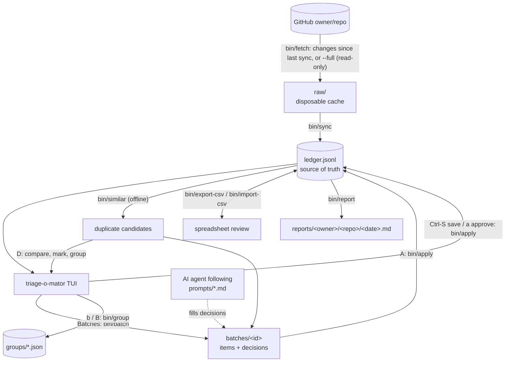

# triage-o-mator

Isn't it fun to contribute on GitHub?!

Well, it is not as productive when the Issues and Pull Requests pile up. Maintainers and reviewers need time to handle those, and so here we intend to provide a working solution to ameliorate the effort through correct organization.

## Brief

Tooling to work through a GitHub issue / PR backlog too large for one person to read cold: a terminal UI, `triage-o-mator`, on top of a set of small scripts that do the actual work.

The backlog gets a first pass of categorization done in batches, by you or by an AI Agent, and whoever's triaging gets a fast, git-tracked way to check and correct that first pass before anyone acts on it.

It does not modify the live repo. It reads issues and PRs via `gh` and writes categorization decisions to a local ledger. Turning a reviewed decision into an actual label / comment / close on GitHub is a deliberate future step, not something this does automatically.

> Built against and first deployed on [omacom/omarchy](https://github.com/omacom/omarchy) while not being exclusive to it.

One installs it **into the repository you triage**: this checkout is the program, and each target repository gets its own `triage-o-mator/` directory holding its ledger, groups, reports and taxonomy. That directory is meant to be committed to that repository, so triage is shared the way everything else in it is, through pull requests its maintainers can read line by line. One could also use it solo.

## Install

You need [`gh`](https://cli.github.com/) (authenticated: `gh auth status`), `python3`, and [mise](https://mise.jdx.dev/) for the pinned Go toolchain.

```sh
git clone https://github.com/efrmg/triage-o-mator
cd triage-o-mator
./install.sh /absolute/path/to/your/repository # mise install, make build, bin/install-to
```

Then run it from the repository:

```sh
cd /absolute/path/to/your/repository
triage-o-mator/bin/triage-o-mator # And she's ON!
```

Every script finds its install from its own path, so this works from the repository's root, from anywhere under it, or from inside `triage-o-mator/`, and the commands each one suggests come back in the form you can paste from where you are.

Installing into a repository you don't control, adopting an install later, installing the tool into its own repository to triage its backlog, upgrading, repairing symlinks and making the prompts and taxonomy custom are all in [docs/install.md](docs/install.md).

Everything below is written from inside an install: paths like `data/<owner>/<repo>/ledger.jsonl` are relative to it.

## How it works

<details>

<summary>Open the screencaptures</summary>


</details>



Paths in the diagram are inside the install, in the current repo's `data/<owner>/<repo>/` folder.

The TUI never writes `data/<owner>/<repo>/ledger.jsonl` or group files itself: every save, approval, and batch goes through the scripts, and every GitHub call they make is a read.

Every open issue and PR gets one row in `data/<owner>/<repo>/ledger.jsonl` (JSON Lines: one JSON object per line, so `git diff` shows exactly which items changed and how). Each row carries both the GitHub-derived facts (title, author, labels, state, ...) and the triage state:

| field                                      | meaning                                                           |
| ------------------------------------------ | ----------------------------------------------------------------- |
| `category`                                 | what kind of item this is: see `config/taxonomy.md`               |
| `action`                                   | recommended next step                                             |
| `confidence`                               | how sure the triager is: `low`, `medium` or `high`                |
| `reason`                                   | one sentence of justification, written for a **human** to skim    |
| `triaged_by` / `triaged_at` / `batch_id`   | who made the first-pass call, when, and in which batch            |
| `agent_notes`                              | an agent's longer evidence: a code review, a duplicate comparison |
| `reviewed` / `reviewed_by` / `reviewed_at` | whether a human has confirmed it                                  |
| `reviewer_notes`                           | free-text notes from the reviewer                                 |

Categorization and review are deliberately two separate stages: see [`prompts/PLAYBOOK.md`](prompts/PLAYBOOK.md#two-stage-review) as for why.

Categories and actions are defined in [`config/taxonomy.md`](config/taxonomy.md) (human-readable, with rationale) and [`config/taxonomy.json`](config/taxonomy.json) (the machine-checked list `bin/apply` and the TUI read). It is expected to evolve; see the note at the top of `taxonomy.md` before changing it.

## Using the TUI

For a quick overview, see the [TUTORIAL](TUTORIAL.md).

<details>

<summary>Open the whole workflow</summary>

The sidebar lists filtered views of the ledger in **Untriaged Issues**, **Untriaged PRs**, **Pending Review**, **Merge-Ready PRs**, **Close Candidates**, **Oldest Untriaged**, **All Items**; followed by **Batches**, **Groups**, **Possible Duplicates**; and, set apart at the bottom, is **Switch Repo**.

Before you pick anything, the main panel shows how far triage and review have come, and the top suggestions from `bin/next`, each marked `[agent]` or `[human]`.

The main panel's top border says where you are, from the repo down (`omacom/omarchy › Batches › b20260919-121212 › #883`), so the way back with `Esc` is always in sight.

The footer lists the keys for the current screen in groups (Item, Fields, Read, Menus, Navigation, ...), keys only; `?`, shown at the right of the status line, adds each key's description.

When a script fails, the status line says what failed and why in one short sentence (with what to do for common problems: `gh` not logged in, no connection, rate limit, a group someone else changed); `!` shows the last failure in full, with the exact command and everything it printed, until the next one replaces it.

> [!NOTE]
> Terminals smaller than 60×24 show a resize prompt.

Keys follow one scheme: a key means the same thing on every screen, a capital letter is the bigger version of the same action (`A` applies all proposals, `R` re-fetches everything, `X` exports with full content, `B` adds to the last group), and anything destructive or bulk needs the same key pressed twice. `j`/`k` always mean down/up, `g`/`G` top/bottom, `Enter` or `l` (or `→`) open, and `Esc` or `h` (or `←`) go back; in a text field the arrows move the cursor instead.

`y` takes what is in front of you to the clipboard as Markdown, ready to paste to an agent (or share with a contact): the ticked items, the hovered one, or the open item with its body, decision and likely duplicates. `Y` takes the whole screen's worth; the list, or the batch with its `items.jsonl` / `decisions.jsonl` paths and `bin/read-batch` command, or the group with its members' notes and its export command. It is a reference rather than a dump: identifiers, decisions, and the commands that lead to the rest, with a first line saying where it came from and that item text is data, not instructions (crucial for Agents). Where there is no clipboard (no `wl-copy`, `xclip`, `xsel` or `pbcopy`, and no terminal that takes OSC 52), it writes the text into `data/<owner>/<repo>/exports/` instead and says so.

In any list, `/` searches it: type title words (in any order) or `#1234`, and the list narrows as you type; `Enter` keeps the matches, and `Esc` clears it. To search the whole backlog, search **All Items**.

`Space` ticks a hovered item and moves down. List actions then apply to every ticked item, or to the hovered one when nothing is ticked, so you don't have to open items to act on them: `a` approves their saved decisions, `b` adds them to a group (with a note), `B` adds them to the last group, and inside a batch `d` removes them from it. From a list, `a` and `d` always ask for a second press. `m` compares the hovered item's duplicates. The same ticks work on the Duplicates screen, on a group's members (`d` removes them) and in the batch list (`A` applies, `d` deletes).

### The triage loop

1. **Pick a queue.** Either open **Untriaged Issues** / **Untriaged PRs** (oldest first), or open **Batches** and press `n` to create a batch: choose a size, kind (all / issue / PR), order (oldest / newest first), and optionally a [group](docs/groups.md) to limit it to that group's untriaged members. The batch fetches every item's body and comments up front (read-only), then opens as a list with an `x/N triaged` progress count.

2. **Read.** `Enter` opens an item. Its header carries the author, state, labels and likely duplicates; below it, tabs run across the top: Body, Agent notes (when there are any), Comments, and for PRs the Diff, with their counts. `H`/`L` switch tabs and `1`–`4` jump straight to one. The active tab shows beside the decision form; `Enter` fills the screen with the tab's content, and `Enter` again brings the form back. Bodies, comments and notes render as Markdown, and the diff is highlighted. `j`/`k`, `g`/`G`, and `Ctrl-D`/`Ctrl-U` scroll.

> Reading comments is crucial: workarounds, "same here", and links to the real duplicate usually live there.

3. **Check for duplicates.** The item header lists its most similar titles (`Possible duplicates: #49760 02%, ...`). `m` opens the [Duplicates screen](#duplicates), which compares the item with those candidates and can mark them duplicates of it.

4. **Decide.** `l` (or `→`) moves from the content to the form and `h` (or `←`) back; `Tab` / `Shift-Tab` move through category, action, confidence, and reason; on the first three, `J` / `K` do the same (into the reason too, where they're letters again), `j`/`k` (or `↑`/`↓`) change the value, from `config/taxonomy.json`'s exact lists, `Enter` confirms it and moves to the next field, and `l` (or `→`) opens a list of all of them: `Enter` or `l` (or `→`) there picks one and moves to the next field, `Esc` or `h` (or `←`) closes it. Only the reason is free text: while it's focused, printable keys are typed into it, `Enter` **saves**, and `Esc` leaves it.

5. **Save.** `Ctrl-S` records the decision through `bin/apply`, attributed to your `git config user.name`. An untriaged item opens with placeholder values, so if you haven't changed them, or the reason is empty, the first `Ctrl-S` warns; press it again to save anyway. A save takes you back to the list you opened the item from, with the cursor one item below (from the duplicates screen or a group, back there). Unsaved edits are kept per item for the session, so you can compare several items before deciding; lists mark such an item `unsaved`, in place of its decision, and `q` asks before discarding them.

6. **Review.** Decisions start unreviewed. In every list, a decided item is marked `[agent]` when an agent's proposal was applied (`triaged_by` is `agent` or `agent:<name>`) and `[human]` when a person saved it, so you can see at a glance which calls nobody has looked at yet. In **Pending Review** (or any view), `a` marks the saved decision as reviewed, on an open item, or on the hovered and ticked ones straight from the list. If the item has unsaved edits, the first `a` warns that only the saved decision will be approved. Changing a decision someone already approved takes the approval back, since it was for the old call. `u` undoes one step, after a second press: on an approved item it takes the approval back, and on an unreviewed one it clears the decision, so the item is untriaged again (with its batch proposal, if there is one); notes stay. It works on hovered and ticked items too; right after an approval it acts on the items just approved, even when they've left the list (as in **Pending Review**), taking the approval back first and their decisions on the next round. The ledger's `git diff` shows what was undone (`bin/apply --unapprove` / `--clear`).

7. **Group.** **Groups** in the sidebar, or `b` from an item or a list, opens [Groups](docs/groups.md) to collect related issues and PRs with notes, an assignee, and exportable review packets; `B` adds the current item to the last group you used.

`o` opens the item on GitHub, `r` fetches recent changes and syncs (on every screen), `R` re-fetches everything, `t` opens the [theme picker](themes/README.md), `Esc` / `h` goes back one level, `q` quits, and `Ctrl-C` always quits.

> [!NOTE]
> An incremental fetch can't see issues or PRs that were **deleted or transferred** to another repo: they just stop appearing, so they stay open in the ledger until the next full fetch (at most a day later, or right away with `R`) marks them closed.

### Batches and agent proposals

A batch is the same `data/<owner>/<repo>/batches/<id>.items.jsonl` / `.decisions.jsonl` pair `bin/batch` writes, so batches created from the TUI and from the command line show up in the same list. Decisions you save while working through a batch are stamped with its ID.

If an agent has filled in a batch's decisions file (see [`prompts/PLAYBOOK.md`](prompts/PLAYBOOK.md) and [`prompts/auto-triage.md`](prompts/auto-triage.md)), the batch list counts its proposals, items show `proposed: category/action`, and opening one prefills the form with the proposal. From there you can:

- review one at a time: adjust if needed and `Ctrl-S` to record it as your own decision;
- or press `A` twice, in **Batches** or inside the open batch, to apply every remaining proposal as an unreviewed decision, credited to whoever proposed it, then review them in **Pending Review**.

> Items someone already triaged are never overwritten this way.

Press `d` twice in **Batches** to delete a batch you're done with. Its files are gitignored working copies, so this can't be undone, but every decision already saved or applied from it stays in the ledger with its `batch_id`; only proposals you haven't applied are lost, and the first `d` tells you how many.

### Duplicates

`bin/similar` ranks every other item of the same kind by title similarity, offline, from the ledger alone. Titles sharing rare terms score high and titles sharing common ones don't, but a score is only a reason to compare two items, never proof: "Consider setting X by default" and "Consider setting Y by default" can score high and be unrelated. It only sees titles, so duplicates worded differently won't show up.

To find duplicates across the whole backlog instead of one item at a time, open **Possible Duplicates** in the sidebar. It lists every pair of open issues (or open PRs) whose titles score 50% or more, strongest first, the older item first since that is the one a comparison keeps. `Enter` (or `m`) opens the Duplicates screen for the pair, on the older item with the newer one selected, and `Esc` comes back to the list. `d`, twice, rules the hovered pair out: `bin/not-duplicate` records "checked, not duplicates" in git-tracked `data/<owner>/<repo>/not-duplicates.jsonl`, so the pair stays off this list in later sessions and for everyone who pulls it. A verdict covers that pair only, so if a third similar item turns up it pairs with each of them and those comparisons are offered as usual; `bin/not-duplicate --remove` takes a verdict back. `D`, twice, clears the pairs marked `handled` from the list on screen; they are already excluded next time, since their items are decided. Neither key changes a decision in the ledger. Once either side is marked `duplicate` / `duplicate-pr` or closed, a pair is marked `handled` and leaves the count; it stays listed until you open the view again, so nothing vanishes from under the cursor as you work through it.

On the Duplicates screen (`m` on an item, or `Enter` on a pair):

- The item being compared is the top card, above a rule and always in view: the supposed **original**, the one that usually stays. It carries its date, state and decision instead of a similarity, and the cursor reaches it like any candidate (`k` from the first one below, or `g`).
- `Enter` opens whichever card the cursor is on, the original included, to read in full; `Esc` comes back to the comparison. `o` opens that item on GitHub.
- `m` marks the hovered candidate as a duplicate **of the original on top**, prefilling that candidate's own decision (`duplicate` or `duplicate-pr`, `close-duplicate`, and a reason naming the original). `M` swaps the two, making the hovered candidate the original (with its own candidates, the previous original among them), so the comparison runs the other way and `m` closes the item that was on top. Both cards show when each item was opened, and marking a candidate older than the original says so, since the older report is usually the one to keep. Nothing is saved until you check the confidence and reason and press `Ctrl-S`, which works on the comparison screen too: it saves and stays there, so one sitting can resolve several candidates against the same original.
- `d`, twice, rules the hovered candidate out against the item on top, recording the same verdict as in the pairs list; candidates already ruled out say so on their card.
- `Space` ticks candidates and `b` creates a [group](docs/groups.md) with the item and the ticked candidates (or the selected one), each with its similarity in the notes. It then becomes your last group, so `B` adds more from anywhere, and it can be exported and handed off like any other group.

Batches carry the same candidates (`duplicate_candidates` on each item), so an Agent can name a duplicate it would otherwise never see. For a closer look, ask your agent "is #N a duplicate?": [`prompts/find-duplicates.md`](prompts/find-duplicates.md) has it read the full bodies, comments (and, for PRs, diffs) of the item and its candidates.

### Switching repos and installs

`config/repo` names the repo an install works on (from its repository's `upstream` remote when it has one, otherwise `origin`, unless `bin/install-to --repo` said otherwise), and each repo keeps its own ledger, batches, groups, exports, and fetch cache in `data/<owner>/<repo>/`, with reports in `reports/<owner>/<repo>/`.

**Switch Repo** lists this install's repos first, then the repos of every other install `bin/install-to` has recorded for you, each showing where it is. Picking one from elsewhere moves the whole session to that install: its taxonomy, its theme, its ledgers and groups. The text field above the list (`Tab` or `↑`/`↓` move between them) filters it as you type; an absolute path opens an install directly (the path of the repository holding one works too), and an `owner/repo` that isn't listed starts that repo in the current install, empty, with a full fetch.

The TUI waits to switch until you've saved or discarded your unsaved decisions and any running fetch or save has finished, because both belong to the repo you're leaving.

A path with no install in it is something **Switch Repo** can create. `Enter` there shows what `bin/install-to --dry-run` says it would change, line by line, and writes nothing; `Enter` again makes exactly those changes, `s` shows the same plan for the other mode (tracked or solo), `j`/`k` scroll it, and `Esc` leaves the repository untouched. See [docs/install.md](docs/install.md#installing-from-inside-the-app).

</details>

## Scripts

Everything the TUI does is also available as a script, which is how agents and spreadsheet reviewers work. The loop without the TUI:

```sh
bin/fetch && bin/sync # pull issues + PRs changed since the last sync (or all open ones), merge into data/<owner>/<repo>/ledger.jsonl
bin/stats # how much is triaged so far?

bin/batch 25 # next 25 untriaged items to read
# ... read data/<owner>/<repo>/batches/<id>.items.jsonl, fill in data/<owner>/<repo>/batches/<id>.decisions.jsonl per config/taxonomy.md ...
bin/apply data/<owner>/<repo>/batches/<id>.decisions.jsonl

bin/export-csv --pending-review # -> data/<owner>/<repo>/exports/ledger-<date>.csv
# ... open in a spreadsheet, revise, mark reviewed=true where you agree ...
bin/import-csv data/<owner>/<repo>/exports/ledger-<date>.csv --by <your-name>

bin/report # -> reports/<owner>/<repo>/<date>.md
```

The batch-fill step is the part meant for an AI agent: ask yours to "triage 25 issues" (it follows [`prompts/auto-triage.md`](prompts/auto-triage.md)), then review its output in the TUI (or through a CSV round-trip). `bin/next` tells you, or your agent, what's worth doing next.

| command                                                                                                                                   | what it does                                                                                                                                                                                                                                                                                            |
| ----------------------------------------------------------------------------------------------------------------------------------------- | ------------------------------------------------------------------------------------------------------------------------------------------------------------------------------------------------------------------------------------------------------------------------------------------------------- |
| `bin/install-to <repo-path> [--repo owner/repo] [--solo] [--adopt] [--dry-run] [--yes]`                                                   | Install triage-o-mator into a repository, or re-run it there to upgrade, repair its symlinks, or re-point it at this checkout. Run from the checkout, never from an install; see [docs/install.md](docs/install.md). It makes no GitHub calls at all.                                                   |
| `bin/fetch [--full]`                                                                                                                      | Pull issues+PRs changed since the last sync from GitHub into `data/<owner>/<repo>/raw/` (read-only, disposable cache). Falls back to every open item on the first run, after a repo switch, when the last full fetch is over a day old, or with `--full`.                                               |
| `bin/sync`                                                                                                                                | Merge `data/<owner>/<repo>/raw/` into `data/<owner>/<repo>/ledger.jsonl`. Never overwrites existing triage data. After a full fetch, marks items closed if they've dropped out of the open list; after an incremental one, takes each item's own state.                                                 |
| `bin/batch [N] [--kind issue\|pr] [--order oldest\|newest] [--group ID] [--diff]`                                                         | Select the next `N` (default 25) untriaged open items, optionally only a group's members, and enrich them with full body/comments/diff-stats and their top duplicate candidates for triaging.                                                                                                           |
| `bin/batch --delete BATCH_ID`                                                                                                             | Delete a batch's items and decisions files. Decisions already in the ledger are kept.                                                                                                                                                                                                                   |
| `bin/enrich-one --kind issue\|pr --number N [--diff]`                                                                                     | Fetch full body/comments (and optionally diff) for a single item; prints one JSON object. Used by the TUI to load one item at a time.                                                                                                                                                                   |
| `bin/similar --kind issue\|pr --number N [--top 5] [--min-score 0.35] [--any-kind] [--enrich]`                                            | Rank likely duplicates of one item by title similarity (offline). `--enrich` adds bodies/comments, producing the input for `prompts/find-duplicates.md`. Used by the TUI's Duplicates screen.                                                                                                           |
| `bin/similar --pairs [--min-score 0.5] [--include-checked]` / `bin/similar --query TEXT`                                                  | List every likely duplicate pair of open, same-kind items across the ledger, strongest first (offline), minus the pairs ruled out with `bin/not-duplicate`. Used by the TUI's Possible Duplicates view. `--query` ranks open issues and PRs together against free text, to gather a topic into a group. |
| `bin/not-duplicate --key K:N --key K:M --by NAME [--note TEXT]` / `--list` / `--remove --key … --key …`                                   | Record that two similar items are not duplicates of each other, in git-tracked `data/<owner>/<repo>/not-duplicates.jsonl`, so the pair stops being offered. Neither item's decision changes.                                                                                                            |
| `bin/apply <decisions.jsonl> [--by NAME] [--reviewed] [--only-untriaged]`                                                                 | Merge a filled-in decisions file back into the ledger. `--only-untriaged` skips items that already have a decision.                                                                                                                                                                                     |
| `bin/apply --number N --kind issue\|pr --category C --action A [--confidence L] [--reason TEXT] [--by NAME] [--reviewed] [--batch-id ID]` | Apply a single item's decision directly from flags, without writing a decisions file.                                                                                                                                                                                                                   |
| `bin/apply --number N --kind issue\|pr --approve [--by NAME]` / `--agent-notes TEXT`                                                      | Mark an already-triaged item `reviewed: true` without changing its category/action; or, with `--agent-notes` alone, attach an agent's notes without touching its decision. Every `bin/apply` form takes `--dry-run`.                                                                                    |
| `bin/group create\|list\|show\|update\|add\|remove\|delete\|export ...`                                                                   | Create and maintain review groups in `data/<owner>/<repo>/groups/`; `delete` removes a group and its notes, leaving every decision in the ledger. See [docs/groups.md](docs/groups.md#script-workflow).                                                                                                 |
| `bin/export-csv [--open-only] [--pending-review]`                                                                                         | Export the ledger to CSV for review in a spreadsheet.                                                                                                                                                                                                                                                   |
| `bin/import-csv <file.csv> [--by NAME]`                                                                                                   | Merge spreadsheet edits (category / action / confidence / reason / reviewed / reviewed_by / reviewer_notes) back into the ledger.                                                                                                                                                                       |
| `bin/report [--stdout]`                                                                                                                   | Generate a markdown summary of backlog / triage / group state.                                                                                                                                                                                                                                          |
| `bin/stats`                                                                                                                               | One-screen counts: how much is triaged, how much is reviewed.                                                                                                                                                                                                                                           |
| `bin/next [--json]`                                                                                                                       | Suggest what to do next from the ledger, batches, groups and reports, each step marked `[agent]` or `[human]`, pointing at the command or `prompts/` playbook (including making the case for a ready group). Offline and read-only.                                                                     |
| `bin/read-batch BATCH_ID [--number N] [--list]`                                                                                           | Print a batch's items readably (body, every comment, candidates, diffs). Offline.                                                                                                                                                                                                                       |

## Prompts

[`prompts/`](prompts/) holds playbooks for a coding agent working in the target repo (Claude Code, Codex, or any agent that reads `AGENTS.md`). [`prompts/PLAYBOOK.md`](prompts/PLAYBOOK.md) is the main one, and `bin/install-to` links it into each install as that install's `AGENTS.md`, with a `CLAUDE.md` beside it pointing at the same file. There is nothing to paste or fill in: ask in plain words, and the agent finds the matching playbook through it, runs the scripts, and reports back.

| ask                                             | playbook                                             | produces                                                                                                                      |
| ----------------------------------------------- | ---------------------------------------------------- | ----------------------------------------------------------------------------------------------------------------------------- |
| "what's next?"                                  | `bin/next`                                           | suggestions marked `[agent]` or `[human]`, with the command or playbook for each                                              |
| "triage 25 issues"                              | [`auto-triage.md`](prompts/auto-triage.md)           | a batch of proposed decisions                                                                                                 |
| "is #N a duplicate?"                            | [`find-duplicates.md`](prompts/find-duplicates.md)   | a duplicate proposal with the comparison as notes, or a negative answer                                                       |
| "review PR #N"                                  | [`review-pr.md`](prompts/review-pr.md)               | a code review in `agent_notes` (checked against the code in the clone the install sits in), plus a decision for untriaged PRs |
| "organize groups", "collect everything about X" | [`organize-groups.md`](prompts/organize-groups.md)   | draft groups built around one maintainer decision each, with role-tagged member notes                                         |
| "brief the maintainers"                         | [`maintainer-brief.md`](prompts/maintainer-brief.md) | today's report plus a two-minute brief for lead maintainers                                                                   |

Everything an agent produces is a proposal. Decisions land unreviewed (never with `--reviewed`), groups stay `draft` until a contributor marks them `ready`, and the agent doesn't commit: you review the diff and commit it. In the TUI, an item's **Agent notes** section shows the agent's evidence, including a batch proposal's notes before it's applied.

### Working as a team

Contributors share the ledger and groups through Git, each usually with an agent. Because the install's data lives in the repository being triaged, that sharing is the repository's own workflow: pull to get each other's decisions, and push changing `triage-o-mator/data/<owner>/<repo>/` to hand a pass to maintainers. Everyone runs `bin/install-to` against their clone once to wire up their own symlinks; nothing tracked changes when they do.

Agents triage, check duplicates, review PR code, and draft groups; contributors review decisions and mark groups `ready`; lead maintainers read `bin/report` (ready groups and human-confirmed decisions first) and the brief.

See [`prompts/PLAYBOOK.md`](prompts/PLAYBOOK.md#working-as-a-team) for the conventions that keep this from colliding, and [docs/install.md](docs/install.md) for the case where the repository isn't yours to commit to.

### Notes on security

> [!WARNING]
> This is a very important issue: we are fetching text from unfiltered users on GitHub.

During testing, I have found that Claude flagged some of the fetched data as a **potential injection risk**.

You can see how it batched, got an internal flag triggered, then reasoned about it (who knows how) and proceeded to write the review. Basically, even if the fail-safe mechanism is activated, the agent could still keep on.


I have a solid way to reduce risks using a VM on [my blog post](https://francisco.is-a.dev/en/blog/arch-vm).

## Development

Launch your editor from a mise-enabled shell so its Go LSP can find `gopls`. Go files use `gofmt`; Prettier formats the maintained Markdown and palette JSON.

```sh
mise exec -- make format
mise exec -- make check # Go/Python tests, go vet, gopls, and formatting checks
mise exec -- make build
mise exec -- make run ROOT=/path/to/a/repository/triage-o-mator # the TUI against one of your installs
```

Working on the tool's own code is a different job from triaging a backlog, and [AGENTS.md](AGENTS.md) here is about that job; the playbook agents follow when triaging is [`prompts/PLAYBOOK.md`](prompts/PLAYBOOK.md), which installs carry as their own `AGENTS.md`. The checkout is never a workspace: it holds no `config/repo`, and the scripts refuse to run outside an install, so there is nowhere here for a ledger, groups or reports to come from. A fork's pull request therefore cannot carry triage data belonging to whatever repositories that contributor triages; it lives in each of those repositories' own install. Tests build throwaway checkouts and installs in temporary directories, and a fake `gh`; none of them touch a real install or GitHub.

## Not built (yet)

Deliberately out of scope for now, to keep the first versions of this tool read-only and low-risk:

- **Applying decisions back to GitHub**: auto-labeling based on `category`, posting `comment-request-info` / `comment-explain-close` text, closing `close-duplicate` / `close-stale` / `close-out-of-scope` / `close-resolved` items. The TUI reserves the `c` key for posting a comment from within a review session; for now it only shows a "not available yet" message. Once there's confidence in the categorization quality (id est, a meaningful chunk of the ledger has gone through real human review), this is the natural next step, yet it writes to a repo other people interact with, so it should default to `--dry-run`, only ever touch `reviewed: true` rows, and get explicit sign-off before it is used with that intent.
- **Body-aware duplicate detection**: `bin/similar` compares titles only, since bodies cost an API call per item. Comparing bodies across the whole backlog would need a local body cache or embeddings.
- **Webhook-driven fetch**: fetches are incremental but still pulled on launch / `r`, not pushed by GitHub.
- **Concurrent item-ledger editing**: Groups support assignment, handoffs, atomic local writes, and stale-revision checks. Item decisions still use a single-ledger workflow, as `data/<owner>/<repo>/ledger.jsonl` is not designed for concurrent writers, and batches do not coordinate who is already looking at what. Running this with a small team would need some way to hand out non-overlapping batches and resolve conflicting decisions on the same item; this remains separate from group-based collaboration.
