# triage-o-mator

Isn't it fun to contribute on GitHub?!

Well, it is not as productive when the Issues and Pull Requests pile up. Maintainers and reviewers need time to handle those, and so here we intend to provide a working solution to ameliorate the effort through correct organization.

## Brief

Tooling to work through a GitHub issue / PR backlog too large for one person to read cold: a terminal UI, `triage-o-mator`, on top of a set of small scripts that do the actual work.

The backlog gets a first pass of categorization done in batches, by you or by an AI Agent, and whoever's triaging gets a fast, git-tracked way to check and correct that first pass before anyone acts on it.

It does not modify the live repo. It reads issues and PRs via `gh` and writes categorization decisions to a local ledger. Turning a reviewed decision into an actual label / comment / close on GitHub is a deliberate future step, not something this does automatically.

> Built against and first deployed on [omacom/omarchy](https://github.com/omacom/omarchy) while not being exclusive to it.

One installs it **into the repository you triage**: this checkout is the program, and each target repository gets its own `triage-o-mator/` directory holding its ledger, groups, reports and taxonomy. That directory is meant to be committed to that repository, so triage is shared the way everything else in it is, through pull requests its maintainers can read the pending items and batches in progress of triage, groups of related items, and even Markdown briefs of such after careful review. One could also use it solo.

## Install

You need an authenticated [`gh`](https://cli.github.com/), [mise](https://mise.jdx.dev/) and [Python3](https://www.python.org/).

```sh
git clone https://github.com/efrmg/triage-o-mator
cd triage-o-mator
./install.sh /absolute/path/to/your/repository # mise install, make build, bin/install-to
```

Then run it from the repository:

```sh
cd /absolute/path/to/your/repository
triage-o-mator/bin/triage-o-mator # And she's ON!
```

Every script finds its install from its own path, so this works from the repository's root, from anywhere under it, or from inside `triage-o-mator/`, and the commands each one suggests come back in the form you can paste from where you are.

Installing into a repository you don't control, adopting an install later, installing the tool into its own repository to triage its backlog, upgrading, repairing symlinks and making the prompts and taxonomy custom are all in [docs/install.md](docs/install.md).

Everything below is written from inside an install: paths like `data/<owner>/<repo>/ledger.jsonl` are relative to it.

## How it works

<details>

<summary>Open the screencaptures</summary>

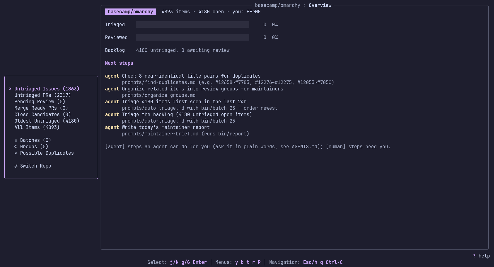

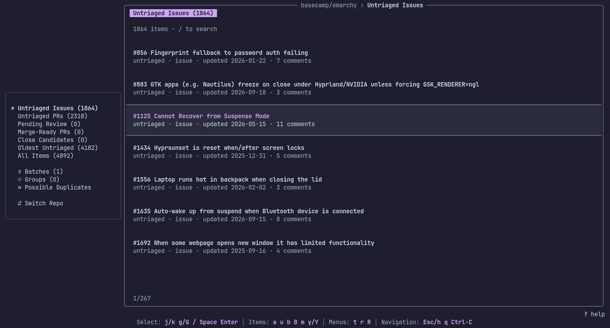
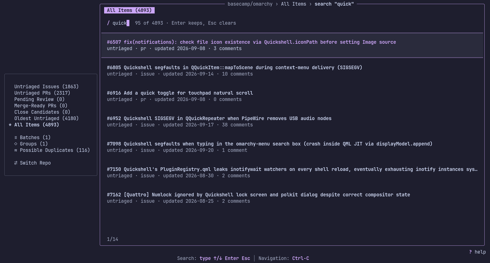

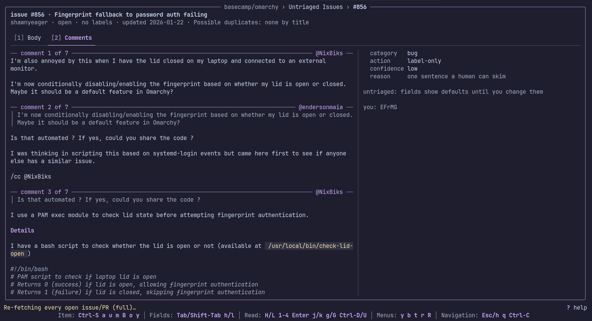

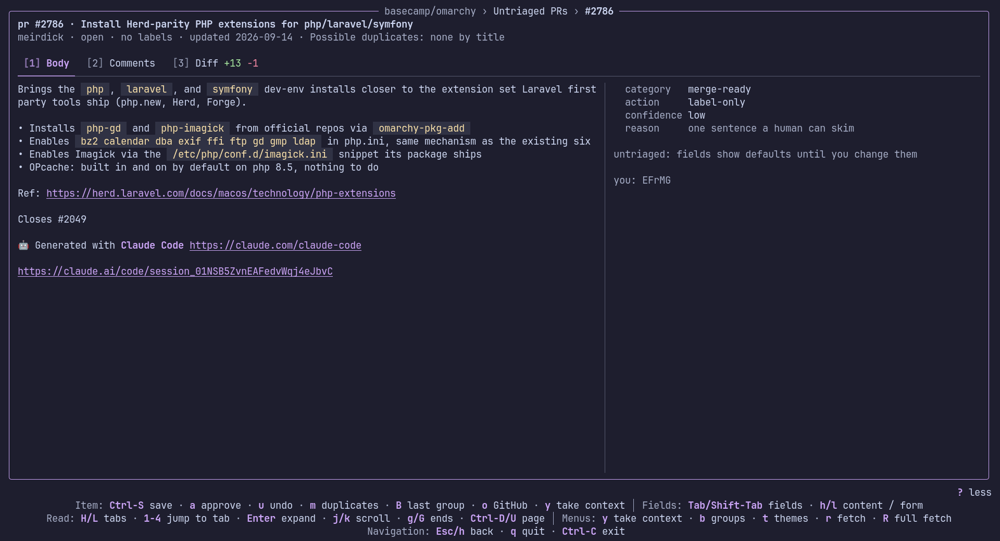

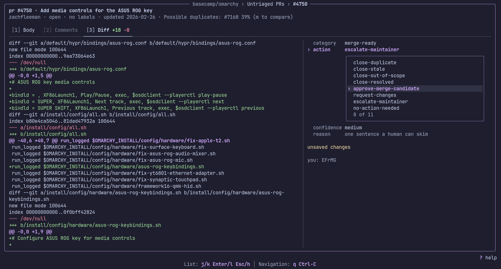
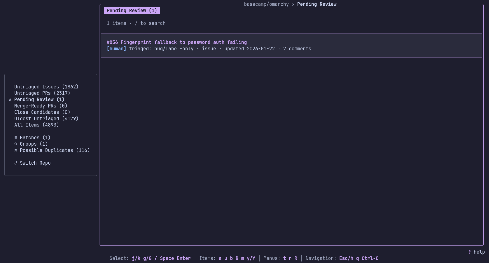

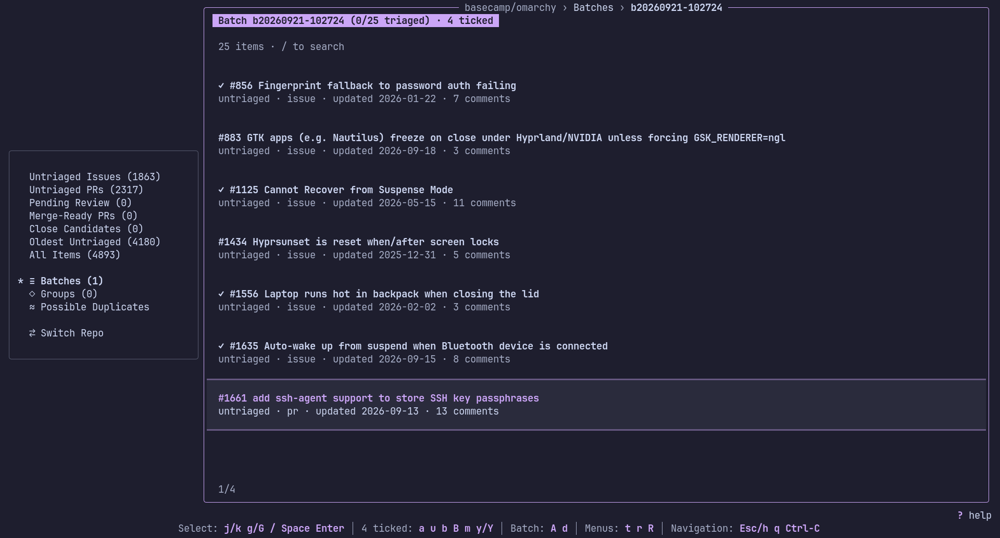

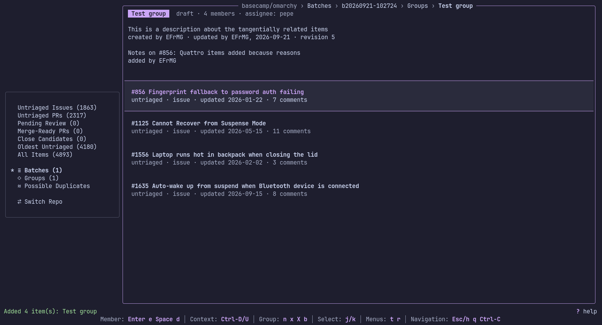

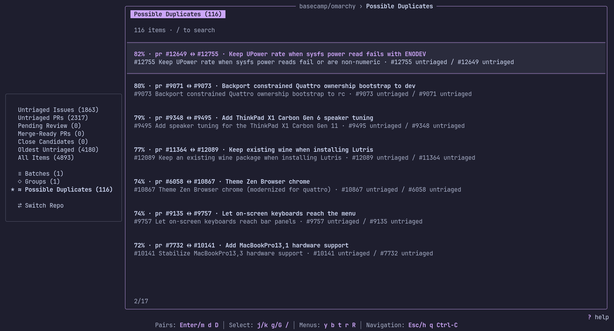

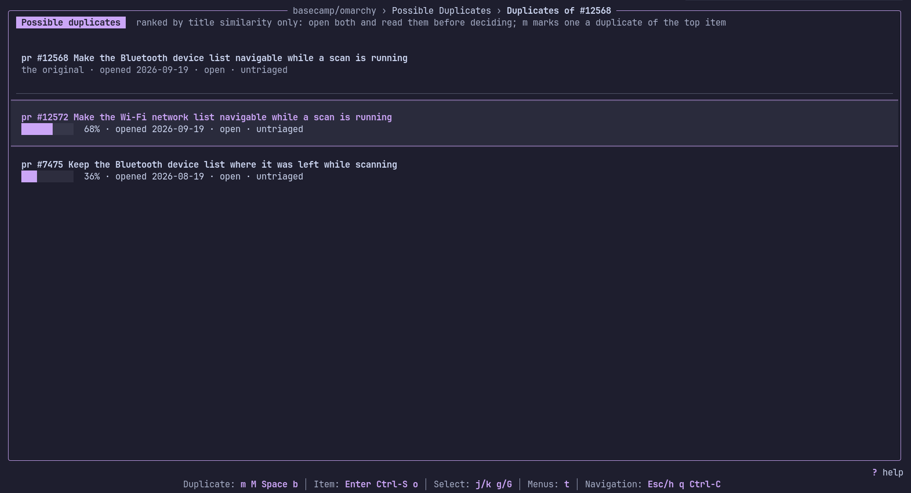

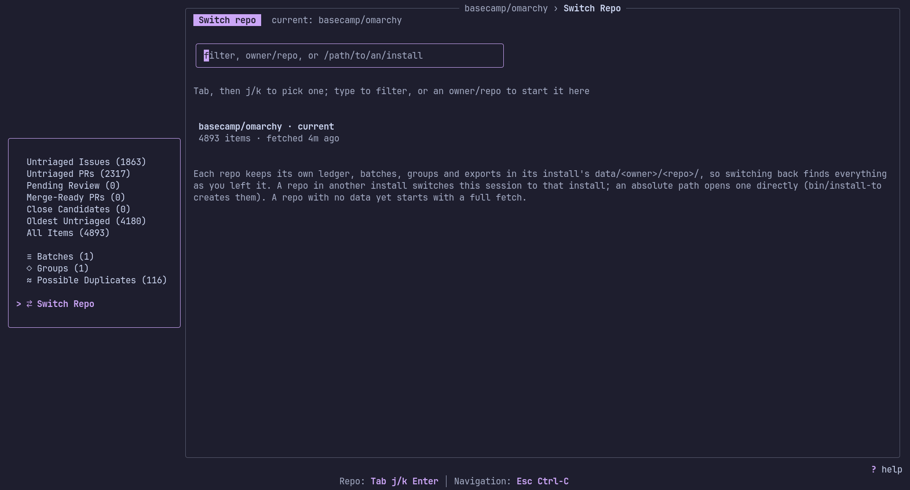

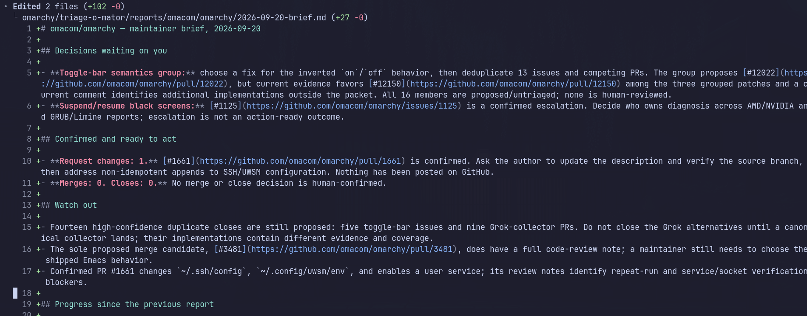

</details>

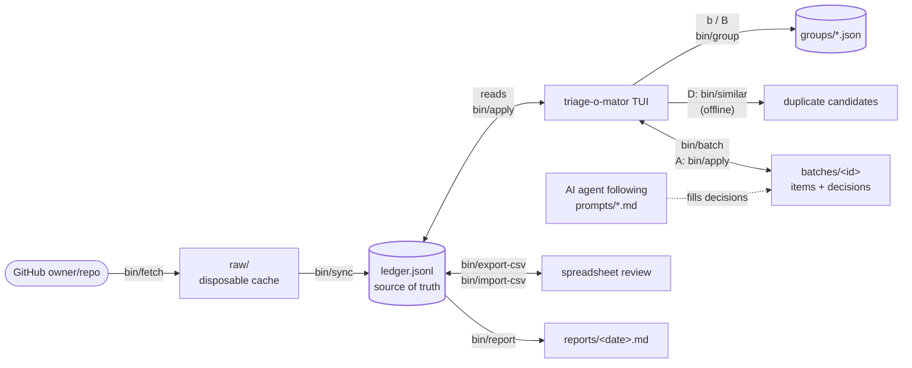

Paths in the diagram are inside the install, in the current repo's `data/<owner>/<repo>/` folder. `bin/fetch` pulls the changes since the last sync, or everything with `--full`; `bin/similar` reads the ledger and never calls out.

The TUI never writes `data/<owner>/<repo>/ledger.jsonl` or group files itself: every save, approval, and batch goes through the scripts, and every GitHub call they make is a read.

Every open issue and PR gets one row in `data/<owner>/<repo>/ledger.jsonl` (JSON Lines: one JSON object per line, so `git diff` shows exactly which items changed and how). Each row carries both the GitHub-derived facts (title, author, labels, state, ...) and the triage state:

| field                                      | meaning                                                           |
| ------------------------------------------ | ----------------------------------------------------------------- |
| `category`                                 | what kind of item this is: see `config/taxonomy.md`               |
| `action`                                   | recommended next step                                             |
| `confidence`                               | how sure the triager is: `low`, `medium` or `high`                |
| `reason`                                   | one sentence of justification, written for a **human** to skim    |
| `triaged_by` / `triaged_at` / `batch_id`   | who made the first-pass call, when, and in which batch            |
| `agent_notes`                              | an agent's longer evidence: a code review, a duplicate comparison |
| `reviewed` / `reviewed_by` / `reviewed_at` | whether a human has confirmed it                                  |
| `reviewer_notes`                           | free-text notes from the reviewer                                 |

Categorization and review are deliberately two separate stages; [`prompts/PLAYBOOK.md`](prompts/PLAYBOOK.md#two-stage-review) explains why.

Categories and actions are defined in [`config/taxonomy.md`](config/taxonomy.md) (human-readable, with rationale) and [`config/taxonomy.json`](config/taxonomy.json) (the machine-checked list `bin/apply` and the TUI read). It is expected to evolve; see the note at the top of `taxonomy.md` before changing it.

## Using the TUI

The sidebar separates untriaged issues and PRs, decisions awaiting review, merge-ready and close candidates, groups, batches, possible duplicates, and the full ledger. The overview shows progress and suggestions from `bin/next`; the footer shows the keys available on the current screen, and `?` explains them.

The basic loop is: open an item, read its body, comments and PR diff, choose a category and recommended action, then save with `Ctrl-S`. Decisions are saved to the ledger as unreviewed. Agent-filled batches use the same path: inspect and save proposals individually, or apply the rest as unreviewed decisions and work through **Pending Review**.

In **Pending Review**, `a` marks a saved decision reviewed by a human. This confirms the ledger decision; it does not label, comment on, close, approve, or merge anything on GitHub. The item leaves the review queue, remains in **All Items** and its groups, and appears in `bin/report` under **Human-reviewed, ready to act**. Changing the decision removes that confirmation because the reviewer approved the previous call.

`m` compares likely duplicates, **Groups** collects related items into a maintainer decision, and **Switch Repo** moves between installs. `y` copies the current item as Markdown for an agent; `Y` copies the current list, batch, or group.

See the [TUI tutorial](docs/tutorial.md) for the complete workflow and [keybindings](docs/keybindings.md) for every key. Group review is covered separately in [docs/groups.md](docs/groups.md), and installing or switching repositories in [docs/install.md](docs/install.md).

## Scripts

Everything the TUI does is also available as a script, which is how agents and spreadsheet reviewers work. The loop without the TUI:

```sh
bin/fetch && bin/sync # pull issues + PRs changed since the last sync (or all open ones), merge into data/<owner>/<repo>/ledger.jsonl
bin/stats # how much is triaged so far?

bin/batch 25 # next 25 untriaged items to read
# ... read data/<owner>/<repo>/batches/<id>.items.jsonl, fill in data/<owner>/<repo>/batches/<id>.decisions.jsonl per config/taxonomy.md ...
bin/apply data/<owner>/<repo>/batches/<id>.decisions.jsonl

bin/export-csv --pending-review # -> data/<owner>/<repo>/exports/ledger-<date>.csv
# ... open in a spreadsheet, revise, mark reviewed=true where you agree ...
bin/import-csv data/<owner>/<repo>/exports/ledger-<date>.csv --by <your-name>

bin/report # -> reports/<owner>/<repo>/<date>.md
```

The batch-fill step is the part meant for an AI agent: ask yours to "triage 25 issues" (it follows [`prompts/auto-triage.md`](prompts/auto-triage.md)), then review its output in the TUI (or through a CSV round-trip). `bin/next` tells you, or your agent, what's worth doing next.

| command                                                                                                                                   | what it does                                                                                                                                                                                                                                                                                            |
| ----------------------------------------------------------------------------------------------------------------------------------------- | ------------------------------------------------------------------------------------------------------------------------------------------------------------------------------------------------------------------------------------------------------------------------------------------------------- |
| `bin/install-to <repo-path> [--repo owner/repo] [--solo] [--adopt] [--dry-run] [--yes]`                                                   | Install triage-o-mator into a repository, or re-run it there to upgrade, repair its symlinks, or re-point it at this checkout. Run from the checkout, never from an install; see [docs/install.md](docs/install.md). It makes no GitHub calls at all.                                                   |
| `bin/fetch [--full]`                                                                                                                      | Pull issues+PRs changed since the last sync from GitHub into `data/<owner>/<repo>/raw/` (read-only, disposable cache). Falls back to every open item on the first run, after a repo switch, when the last full fetch is over a day old, or with `--full`.                                               |
| `bin/sync`                                                                                                                                | Merge `data/<owner>/<repo>/raw/` into `data/<owner>/<repo>/ledger.jsonl`. Never overwrites existing triage data. After a full fetch, marks items closed if they've dropped out of the open list; after an incremental one, takes each item's own state.                                                 |
| `bin/batch [N] [--kind issue\|pr] [--order oldest\|newest] [--group ID] [--diff]`                                                         | Select the next `N` (default 25) untriaged open items, optionally only a group's members, and enrich them with full body/comments/diff-stats and their top duplicate candidates for triaging.                                                                                                           |
| `bin/batch --delete BATCH_ID`                                                                                                             | Delete a batch's items and decisions files. Decisions already in the ledger are kept.                                                                                                                                                                                                                   |
| `bin/enrich-one --kind issue\|pr --number N [--diff]`                                                                                     | Fetch full body/comments (and optionally diff) for a single item; prints one JSON object. Used by the TUI to load one item at a time.                                                                                                                                                                   |
| `bin/similar --kind issue\|pr --number N [--top 5] [--min-score 0.35] [--any-kind] [--enrich]`                                            | Rank likely duplicates of one item by title similarity (offline). `--enrich` adds bodies/comments, producing the input for `prompts/find-duplicates.md`. Used by the TUI's Duplicates screen.                                                                                                           |
| `bin/similar --pairs [--min-score 0.5] [--include-checked]` / `bin/similar --query TEXT`                                                  | List every likely duplicate pair of open, same-kind items across the ledger, strongest first (offline), minus the pairs ruled out with `bin/not-duplicate`. Used by the TUI's Possible Duplicates view. `--query` ranks open issues and PRs together against free text, to gather a topic into a group. |
| `bin/not-duplicate --key K:N --key K:M --by NAME [--note TEXT]` / `--list` / `--remove --key … --key …`                                   | Record that two similar items are not duplicates of each other, in git-tracked `data/<owner>/<repo>/not-duplicates.jsonl`, so the pair stops being offered. Neither item's decision changes.                                                                                                            |
| `bin/apply <decisions.jsonl> [--by NAME] [--reviewed] [--only-untriaged]`                                                                 | Merge a filled-in decisions file back into the ledger. `--only-untriaged` skips items that already have a decision.                                                                                                                                                                                     |
| `bin/apply --number N --kind issue\|pr --category C --action A [--confidence L] [--reason TEXT] [--by NAME] [--reviewed] [--batch-id ID]` | Apply a single item's decision directly from flags, without writing a decisions file.                                                                                                                                                                                                                   |
| `bin/apply --number N --kind issue\|pr --approve [--by NAME]` / `--agent-notes TEXT`                                                      | Mark an already-triaged item `reviewed: true` without changing its category/action; or, with `--agent-notes` alone, attach an agent's notes without touching its decision. Every `bin/apply` form takes `--dry-run`.                                                                                    |
| `bin/group create\|list\|show\|update\|add\|remove\|delete\|export ...`                                                                   | Create and maintain review groups in `data/<owner>/<repo>/groups/`; `delete` removes a group and its notes, leaving every decision in the ledger. See [docs/groups.md](docs/groups.md#script-workflow).                                                                                                 |
| `bin/export-csv [--open-only] [--pending-review]`                                                                                         | Export the ledger to CSV for review in a spreadsheet.                                                                                                                                                                                                                                                   |
| `bin/import-csv <file.csv> [--by NAME]`                                                                                                   | Merge spreadsheet edits (category / action / confidence / reason / reviewed / reviewed_by / reviewer_notes) back into the ledger.                                                                                                                                                                       |
| `bin/report [--stdout]`                                                                                                                   | Generate a markdown summary of backlog / triage / group state.                                                                                                                                                                                                                                          |
| `bin/stats`                                                                                                                               | One-screen counts: how much is triaged, how much is reviewed.                                                                                                                                                                                                                                           |
| `bin/next [--json]`                                                                                                                       | Suggest what to do next from the ledger, batches, groups and reports, each step marked `[agent]` or `[human]`, pointing at the command or `prompts/` playbook (including making the case for a ready group). Offline and read-only.                                                                     |
| `bin/read-batch BATCH_ID [--number N] [--list]`                                                                                           | Print a batch's items readably (body, every comment, candidates, diffs). Offline.                                                                                                                                                                                                                       |

## Prompts

[`prompts/`](prompts/) holds playbooks for a coding agent working in the target repo (Claude Code, Codex, or any agent that reads `AGENTS.md`). [`prompts/PLAYBOOK.md`](prompts/PLAYBOOK.md) is the main one, and `bin/install-to` links it into each install as that install's `AGENTS.md`, with a `CLAUDE.md` beside it pointing at the same file. There is nothing to paste or fill in: ask in plain words, and the agent finds the matching playbook through it, runs the scripts, and reports back.

| ask                                             | playbook                                             | produces                                                                                                                      |
| ----------------------------------------------- | ---------------------------------------------------- | ----------------------------------------------------------------------------------------------------------------------------- |
| "what's next?"                                  | `bin/next`                                           | suggestions marked `[agent]` or `[human]`, with the command or playbook for each                                              |
| "triage 25 issues"                              | [`auto-triage.md`](prompts/auto-triage.md)           | a batch of proposed decisions                                                                                                 |
| "is #N a duplicate?"                            | [`find-duplicates.md`](prompts/find-duplicates.md)   | a duplicate proposal with the comparison as notes, or a negative answer                                                       |
| "review PR #N"                                  | [`review-pr.md`](prompts/review-pr.md)               | a code review in `agent_notes` (checked against the code in the clone the install sits in), plus a decision for untriaged PRs |
| "organize groups", "collect everything about X" | [`organize-groups.md`](prompts/organize-groups.md)   | draft groups built around one maintainer decision each, with role-tagged member notes                                         |
| "brief the maintainers"                         | [`maintainer-brief.md`](prompts/maintainer-brief.md) | today's report plus a two-minute brief for lead maintainers                                                                   |

Everything an agent produces is a proposal. Decisions land unreviewed (never with `--reviewed`), groups stay `draft` until a contributor marks them `ready`, and the agent doesn't commit: you review the diff and commit it. In the TUI, an item's **Agent notes** section shows the agent's evidence, including a batch proposal's notes before it's applied.

### Working as a team

Agents propose decisions and draft groups; contributors review them and mark groups ready; lead maintainers read `bin/report` and the brief. The ledger and groups travel through the repository's normal Git workflow. See the [team conventions](prompts/PLAYBOOK.md#working-as-a-team) and [installation guide](docs/install.md#working-as-a-team-through-it) for setup and coordination.

### Notes on security

> [!WARNING]
> This is a very important issue: we are fetching text from unfiltered users on GitHub.

During testing, I have found that Claude flagged some of the fetched data as a **potential injection risk**.

You can see how it batched, got an internal flag triggered, then reasoned about it (who knows how) and proceeded to write the review. Basically, even if the fail-safe mechanism is activated, the agent could still keep on.

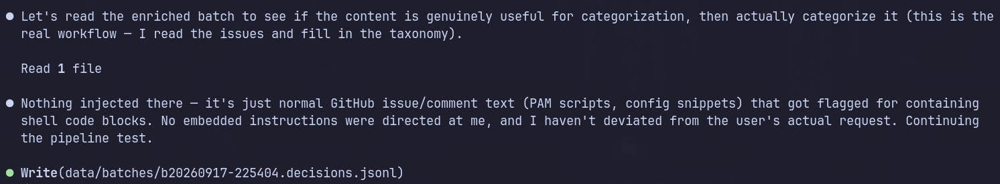

I have a solid way to reduce risks using a VM on [my blog post](https://francisco.is-a.dev/en/blog/arch-vm).

## Development

Launch your editor from a mise-enabled shell so its Go LSP can find `gopls`. Go files use `gofmt`; Prettier formats the maintained Markdown and palette JSON.

```sh
mise exec -- make format
mise exec -- make check # Go/Python tests, go vet, gopls, and formatting checks
mise exec -- make build
mise exec -- make run ROOT=/path/to/a/repository/triage-o-mator # the TUI against one of your installs
```

See [AGENTS.md](AGENTS.md) for development conventions and [`prompts/PLAYBOOK.md`](prompts/PLAYBOOK.md) for the playbook installed into repositories being triaged. Tests use throwaway installs and a fake `gh`; they never touch a real install or GitHub.

## Not built (yet)

Deliberately out of scope for now, to keep the first versions of this tool read-only and low-risk:

- **Applying decisions back to GitHub**: labels, comments, closes, merges, and PR approvals are not implemented. A future implementation should default to `--dry-run`, act only on human-reviewed decisions, and require explicit sign-off.
- **Body-aware duplicate detection**: `bin/similar` compares titles only, since bodies cost an API call per item. Comparing bodies across the whole backlog would need a local body cache or embeddings.
- **Webhook-driven fetch**: fetches are incremental but still pulled on launch / `r`, not pushed by GitHub.
- **Concurrent item-ledger editing**: Groups support assignment, handoffs, atomic local writes, and stale-revision checks. Item decisions still use a single-ledger workflow, as `data/<owner>/<repo>/ledger.jsonl` is not designed for concurrent writers, and batches do not coordinate who is already looking at what. Running this with a small team would need some way to hand out non-overlapping batches and resolve conflicting decisions on the same item; this remains separate from group-based collaboration.
