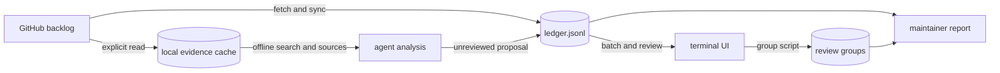

# triage-o-mator

Isn't it fun to contribute on GitHub?!

Well, it is not as productive when the Issues and Pull Requests pile up. Maintainers and reviewers need time to handle those, and so here we intend to provide a working solution to ameliorate the effort through correct organization.

## Brief

Tooling to work through a GitHub issue / PR backlog too large for one person to read cold: a terminal UI, `triage-o-mator`, on top of a set of small scripts that do the actual work.

The backlog gets a first pass of categorization done in batches, by you or by an AI Agent, and whoever's triaging gets a fast, git-tracked way to check and correct that first pass before anyone acts on it.

It does not modify the live repo. It reads issues and PRs via `gh` and writes categorization decisions to a local ledger. Turning a reviewed decision into an actual label / comment / close on GitHub is a deliberate future step, not something this does automatically.

> Developed with the [omacom/omarchy](https://github.com/omacom/omarchy) backlog in mind, while supporting other GitHub repositories. Adoption by Omarchy is a goal, not an existing deployment.

One installs it **into the repository you triage**: this checkout is the program, and each target repository gets its own `triage-o-mator/` directory holding its ledger, groups, reports and taxonomy. That directory is meant to be committed to that repository, so triage is shared the way everything else in it is, through pull requests its maintainers can read the pending items and batches in progress of triage, groups of related items, and even Markdown briefs of such after careful review. One could also use it solo.

## Install

You need an authenticated [`gh`](https://cli.github.com/), [mise](https://mise.jdx.dev/) and [Python3](https://www.python.org/).

```sh
git clone https://github.com/efrmg/triage-o-mator
cd triage-o-mator
./install.sh /absolute/path/to/your/repository # mise install, make build, bin/install-to
```

Then run it from the repository:

```sh
cd /absolute/path/to/your/repository
triage-o-mator/bin/triage-o-mator # And she's ON!
```

Every script finds its install from its own path, so this works from the repository's root, from anywhere under it, or from inside `triage-o-mator/`, and the commands each one suggests come back in the form you can paste from where you are.

Installing into a repository you don't control, adopting an install later, installing the tool into its own repository to triage its backlog, upgrading, repairing symlinks and making the prompts and taxonomy custom are all in [docs/install.md](docs/install.md).

Working from a fork? The install can live in your fork while reading the upstream backlog. For example, from this built tool checkout:

```sh
bin/install-to /absolute/path/to/your/omarchy --repo omacom/omarchy --dry-run
bin/install-to /absolute/path/to/your/omarchy --repo omacom/omarchy
```

Here the local clone can be `efrmg/omarchy`; `--repo` explicitly chooses whose issues and PRs to read. The [fork walkthrough](docs/install.md#working-from-a-fork) covers an existing install, tracked versus solo work, and sharing the results. No upstream write access is required.

Everything below is written from inside an install: paths like `data/<owner>/<repo>/ledger.jsonl` are relative to it.

## How it works

<details>

<summary>Open the screencaptures</summary>


</details>

The ledger tracks item facts and local triage decisions. The cache keeps larger, versioned observations for offline analysis. Groups and reports turn reviewed work into a handoff for maintainers.



An item first enters the ledger when observed open. Later syncs retain its row after closure, along with its triage and review history. `bin/sync` does not import every item that closed before that first observation. The TUI saves ledger and group changes through scripts; GitHub operations are reads.

Each ledger row includes:

| field                                      | meaning                                                           |
| ------------------------------------------ | ----------------------------------------------------------------- |
| `category`                                 | what kind of item this is: see `config/taxonomy.md`               |
| `action`                                   | recommended next step                                             |
| `confidence`                               | how sure the triager is: `low`, `medium` or `high`                |
| `reason`                                   | one sentence of justification, written for a **human** to skim    |
| `triaged_by` / `triaged_at` / `batch_id`   | who made the first-pass call, when, and in which batch            |
| `agent_notes`                              | an agent's longer evidence: a code review, a duplicate comparison |
| `reviewed` / `reviewed_by` / `reviewed_at` | whether a human has confirmed it                                  |
| `reviewer_notes`                           | free-text notes from the reviewer                                 |

Categorization and review are deliberately two separate stages; [`prompts/PLAYBOOK.md`](prompts/PLAYBOOK.md#two-stage-review) explains why.

The ledger and other transactional records use atomic replacement; reports and CSV exports do not. See [local storage and recovery](docs/storage.md).

Categories and actions are defined in [`config/taxonomy.md`](config/taxonomy.md) (human-readable, with rationale) and [`config/taxonomy.json`](config/taxonomy.json) (the machine-checked list `bin/apply` and the TUI read). It is expected to evolve; see the note at the top of `taxonomy.md` before changing it.

## Using the TUI

Open an issue or PR, read its context, and save a proposed category and action. A proposal remains unreviewed until a human confirms it. **Pending Review** collects those decisions; confirmation changes the local ledger and does not act on GitHub.

**Possible Duplicates** offers leads for closer reading. **Groups** collects related items, notes, an assignee and a draft/ready/archived status so a lead maintainer can review them together. Group export creates a packet for that handoff. **Local dataset** saves backlog evidence for offline search and comparison. Press `w` on any issue or PR to track new comments in **Notifications**. The app checks tracked comments at startup and on a normal ledger refresh. Notifications has **Needs attention** and **Past actions**: new comments and unviewed saved PR activity or imported actions appear above viewed or quiet items. `v` moves a selected alert to Past actions; one `d` dismisses a selected row. Tracked items stop being checked when dismissed; saved PR records remain available to offline readers. Opening a tracked item fetches fresh details.

The [tutorial](docs/tutorial.md) walks through these tasks. The TUI footer and [keybindings](docs/keybindings.md) give the controls; [group review](docs/groups.md) and [cache evidence](docs/evidence.md) have the details.

## Scripts

Run scripts from an install in the repository being triaged. A first `bin/fetch && bin/sync` creates the ledger from open items. Later syncs update those rows and **keep closed items in the ledger**. This gives an initial backlog baseline; it does not import every closure that predates the first fetch.

```sh
bin/fetch && bin/sync
bin/stats
bin/batch 25
# Fill the batch's decisions.jsonl, then review the proposals:
bin/apply data/<owner>/<repo>/batches/<id>.decisions.jsonl --only-untriaged --dry-run
bin/apply data/<owner>/<repo>/batches/<id>.decisions.jsonl --only-untriaged
bin/report
```

| Command                                    | Purpose                                                                                                                                                                                            |
| ------------------------------------------ | -------------------------------------------------------------------------------------------------------------------------------------------------------------------------------------------------- |
| `bin/install-to`                           | Install into a target repository, including a fork; see the [fork walkthrough](docs/install.md#working-from-a-fork).                                                                               |
| `bin/fetch`, `bin/sync`                    | Read the backlog and update the git-tracked ledger without erasing local decisions.                                                                                                                |
| `bin/batch`, `bin/read-batch`, `bin/apply` | Prepare fixed review batches, inspect them and save decisions or human approval.                                                                                                                   |
| `bin/similar`, `bin/not-duplicate`         | Find title-based duplicate leads and retain attributed negative verdicts.                                                                                                                          |
| `bin/group`                                | Collect items and notes, assign a maintainer, and export a review packet.                                                                                                                          |
| `bin/cache`                                | Acquire selected or frozen backlog evidence, search and read it offline, and retain closure history. See the [cache reference](docs/evidence-reference.md) and [appeals](docs/appeal-evidence.md). |
| `bin/enrich-one`                           | Read one issue or PR, with optional explicit cache mode.                                                                                                                                           |
| `bin/export-csv`, `bin/import-csv`         | Review ledger decisions in a spreadsheet with revision checks.                                                                                                                                     |
| `bin/stats`, `bin/next`, `bin/report`      | Inspect progress, next tasks and the maintainer report.                                                                                                                                            |

The standard Local dataset downloads descriptions and discussion for open issues and PRs, plus PR file lists, diffs, and closing-issue links. Saved snapshots and their gaps are available to agents through [bounded offline readers](docs/evidence-reference.md#bounded-offline-snapshot-readers); a candidate match still needs source review. Selected PR reads can obtain further components when needed. The [agent preparation prompt](prompts/prepare-analysis.md) starts from the saved dataset rather than refetching each candidate.

## Prompts

[`prompts/PLAYBOOK.md`](prompts/PLAYBOOK.md) is linked into each install as its agent instructions. Ask in plain words; the matching task prompt explains what to read and what may be saved.

| Ask                        | Prompt                                          | Result                                       |
| -------------------------- | ----------------------------------------------- | -------------------------------------------- |
| “triage 25 issues”         | [Auto triage](prompts/auto-triage.md)           | Unreviewed batch proposals                   |
| “prepare offline analysis” | [Prepare analysis](prompts/prepare-analysis.md) | A scoped cache handoff with gaps             |
| “is #N a duplicate?”       | [Find duplicates](prompts/find-duplicates.md)   | A sourced comparison or proposal             |
| “review PR #N”             | [Review PR](prompts/review-pr.md)               | Code review notes and an unreviewed decision |
| “organize these items”     | [Organize groups](prompts/organize-groups.md)   | Draft maintainer groups                      |
| “review an appeal”         | [Review appeal](prompts/review-appeal.md)       | An attributed local reassessment             |
| “brief the maintainers”    | [Maintainer brief](prompts/maintainer-brief.md) | A short review brief                         |
| “polish the report”        | [Polish report](prompts/polish-report.md)       | An evidence-backed report                    |

Agents propose; a human reviews. Fetched GitHub text is untrusted input, so review agent conclusions and the local diff before sharing them.

## Development

Use `mise exec -- make check` for Go and Python checks, and `mise exec -- make build` for the TUI. See [AGENTS.md](AGENTS.md) for repository conventions.

## Not Implemented (yet)

- GitHub write actions: the tool does not label, comment on, reopen, close or merge items.
- Automatic appeal monitoring: closed-PR watches require explicit enrollment and polling after the ledger baseline; closed issues have no watch yet.
- Verified identification of an external auto-closure operator: imported explanations are attributed claims, not authenticated runner records.
