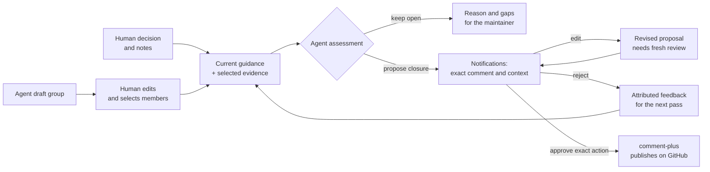
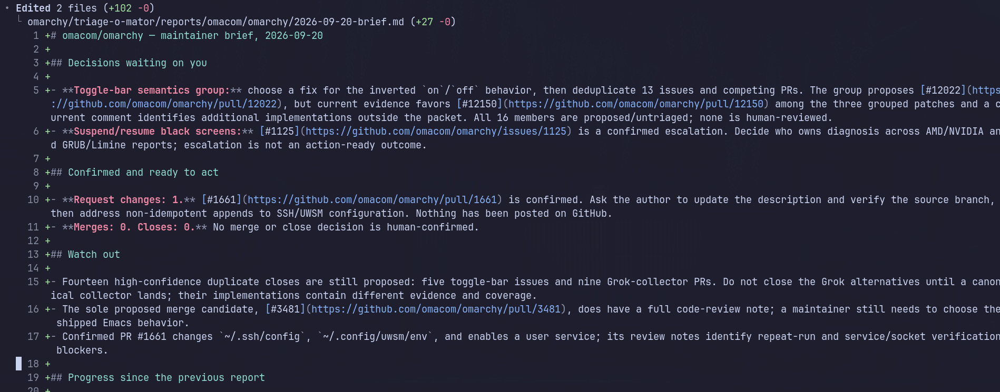

# triage-o-mator

Isn't it fun to contribute on GitHub?!

Well, it is not as productive when the Issues and Pull Requests pile up. Maintainers and reviewers need time to handle those, and so here we intend to provide a working solution to ameliorate the effort through correct organization.

## Brief

Tooling to work through a GitHub issue / PR backlog too large for one person to read cold: a terminal UI, `triage-o-mator`, on top of a set of small scripts that do the actual work.

The backlog gets a first pass of categorization done in batches, by you or by an AI Agent, and whoever's triaging gets a fast, git-tracked way to check and correct that first pass before anyone acts on it.

It reads issues and PRs via `gh` and writes categorization decisions to a local ledger. You can also compose and explicitly approve a GitHub comment, closure or reopening through the TUI; publishing defaults to dry-run and never follows automatically from a triage decision.

> Developed with the [omacom/omarchy](https://github.com/omacom/omarchy) backlog in mind, while supporting other GitHub repositories. Omarchy is a public proof-of-concept target, not an existing deployment.

One installs it **into the repository you triage**: this checkout provides the program, while each target repository own `triage-o-mator/`, directory with its ledger, groups, automated proposals, reports and taxonomy. Reviewed decisions and group guidance can travel through ordinary Git pull requests. Batches and evidence caches are local working data. Using it solo is also possible.

## How it works

The ledger records local decisions and human review. Groups hold tangentially related items together; the cache keeps versioned GitHub data for offline analysis. An agent can start from different standpoints, while reading current guidance and evidence, then explains your concerns or proposes actions to be confirmed of execution.


```mermaid
flowchart LR
    HUMAN["Human decision<br/>and notes"] --> CONTEXT["Current guidance<br/>+ selected evidence"]
    GROUP["Agent draft group"] --> EDIT["Human edits<br/>and selects members"] --> CONTEXT
    CONTEXT --> AGENT{"Agent assessment"}
    AGENT -->|"keep open"| OPEN["Reason and gaps<br/>for the maintainer"]
    AGENT -->|"propose closure"| NOTICE["Notifications:<br/>exact comment and context"]
    NOTICE -->|"edit"| REVIEW["Revised proposal<br/>needs fresh review"] --> NOTICE
    NOTICE -->|"reject"| FEEDBACK["Attributed feedback<br/>for the next pass"] --> CONTEXT
    NOTICE -->|"approve exact action"| WRITE["comment-plus<br/>publishes on GitHub"]
```

**Notifications** shows the target, comment, human guidance and evidence gaps before approval. A reviewer can edit, reject with an optional attributed reason, or approve the upstream write action. Rejection stays available to the next agent pass; changed guidance requires a fresh proposal and review.

Group `ready`, ledger `reviewed`, and approval to publish on GitHub while being the three main pillars in the flow: **similar items, human review, and agentic actionable proposals**.

An item first enters the ledger when observed open. Later syncs retain its row after closure and preserve its decision history.

## Install

You need an authenticated [`gh`](https://cli.github.com/), [mise](https://mise.jdx.dev/) and [Python3](https://www.python.org/).

```sh
gh repo clone efrmg/triage-o-mator && cd triage-o-mator
./install.sh /path/to/your/repository # mise install, make build, bin/install-to

cd /path/to/your/repository
triage-o-mator/bin/triage-o-mator # And she's ON!
```

Every script finds its install from its own path, so commands work from the repository root or inside `triage-o-mator/`.

The [installation guide](docs/install.md) covers solo installs, adoption, upgrades and custom prompts and taxonomy.

## Walkthrough

The [tutorial](docs/tutorial.md) walks through these tasks and their controls. [Group review](docs/groups.md) and [cache evidence](docs/evidence.md) have some extra details.

Mouse controls work alongside the keyboard keys.

0. **Get oriented and refresh.** The overview shows the current repository, triage and review progress, and suggestions from `bin/next`. Refresh changed issues and PRs, or run a full refresh when needed. This does not overwrite local decisions.


1. **Choose and read the work.** Open **Untriaged** or a prepared **Batch**; filter issues and PRs, change the age order, search, or select several items for one action. Open an item to read its body, agent notes, comments and PR diff. You are able to copy short handoffs for Agents throughout most menus.


2. **Make a first pass, then review it.** Choose a category, action and confidence, with a short reason. Save a decision for later review or confirm one you have checked yourself. An agent can prepare a batch from copied item or list context; inspect its suggestions in **Batches**, then save them individually or apply the rest as unreviewed decisions. **Pending Review** is where a person verifies and revises those decisions. Reviewed items stay in **All Items** and groups; editing one removes its old confirmation. A reviewed ledger decision does not execute its recommended action.


3. **Compare, group and hand work back to an agent.** **Possible Duplicates** offers pairs to inspect; compare both sides before recording a duplicate or ruling out a false match. An agent can prepare a focused draft **Group** of related items. Edit its description and member notes, then use `y` for selected members or `Y` for all to copy a current handoff. The agent prepares recommendations only for those members, including ones already triaged. A person can mark a checked group `ready` for maintainers; that does not approve its members' decisions or later actions.


4. **Local dataset** freezes the open backlog and downloads descriptions, discussions, PR files, diffs and closing links. Press `f`, then turn automatic download **ON**, running then and after startup or backlog refreshes. An Agent therefore can search without having to fetch GH and bloat its context with irrelevant data (while taking longer), while also taking from past saved observations. Missing, partial or old evidence remains visible.


5. **Review proposals and follow-up in Notifications.** A PR closure proposal shows its explanatory comment, relevant human guidance, earlier objections and selected evidence gaps. Approve, edit, or reject it with an optional reason. Edits need fresh review; a rejection remains in shared history for the next agent pass. You can also track issue and PR comments in this menu; it separates items needing attention from past activity; `viewing` and `dismissing` rows does not confirm appeals, nor approve decisions.


6. **Publish an approved GitHub action.** Compose a comment, or close or reopen an item with one as well. Bulk actions show every target before publication; an uncertain result stops the remaining actions for inspection.

> GitHub PR approval, labeling and merging are not supported (yet).


7. **Hand reviewed work to maintainers.** Export a group or batch for a review packet, then gather ready groups and human-reviewed decisions into a dated Markdown report. An agent can turn it into a concise maintainer brief!



8. **Switch repositories when needed.** Each have its own taxonomy, ledger, batches, groups, exports and reports. The TUI asks about unsaved drafts before switching and rejects late read replies.


## Working from a fork

An install can live in a fork while reading the upstream backlog. From this built tool checkout, for example:

```sh
bin/install-to /path/to/your/omarchy --repo omacom/omarchy
```

The local clone could be your fork; `--repo` chooses whose issues and PRs to read. Browsing and preparing proposals needs no upstream write access; publishing there does. See the [fork walkthrough](docs/install.md#working-from-a-fork) for tracked and solo work.

## Reference

The paths below are relative to an install: `data/<owner>/<repo>/ledger.jsonl`, for example.

### Local records

Each ledger row has a category, recommended action, confidence and reason, plus triage attribution and optional agent notes. Separate review fields record whether a person confirmed it and any reviewer notes; [the playbook](prompts/PLAYBOOK.md#two-stage-review) explains the distinction. Teams own their [taxonomy](config/taxonomy.md), with a [machine-readable copy](config/taxonomy.json) used by the TUI and scripts.

The ledger and other transactional records use atomic replacement; reports and CSV exports do not. See [local storage and recovery](docs/storage.md).

### Scripts

These run from an install in the repository being triaged.

Here are examples:

```sh
bin/fetch && bin/sync
bin/stats
bin/batch 25
bin/apply data/<owner>/<repo>/batches/<id>.decisions.jsonl --only-untriaged
bin/report
```

| Task                         | Commands                                                                       |
| ---------------------------- | ------------------------------------------------------------------------------ |
| Install and refresh          | `bin/install-to`, `bin/fetch`, `bin/sync`                                      |
| Prepare and review decisions | `bin/batch`, `bin/read-batch`, `bin/apply`, `bin/export-csv`, `bin/import-csv` |
| Compare and group            | `bin/similar`, `bin/not-duplicate`, `bin/group`                                |
| Read guidance and evidence   | `bin/item-context`, `bin/cache`, `bin/enrich-one`, `bin/reposition-env`        |
| Propose and publish actions  | `bin/auto-close`, `bin/comment-plus`                                           |
| See progress and handoffs    | `bin/stats`, `bin/next`, `bin/report`                                          |

The [evidence reference](docs/evidence-reference.md), [group guide](docs/groups.md) and [comment publishing guide](docs/comment-plus.md) cover the commands and their limits.

Closed-PR [watches](docs/appeal-evidence.md) and [external closure records](docs/external-closures.md) have separate guides.

[Bounded evidence readers](docs/evidence-reference.md#bounded-offline-snapshot-readers) expose selected snapshots and gaps without filling missing data from GitHub. The [agent preparation prompt](prompts/prepare-analysis.md) starts with saved evidence and asks for focused source review before any recommendation.

## Prompts

For optional offline ranked cache queries and verified fragment retrieval, see
[the Reposition bridge](docs/reposition.md). Existing literal search needs no
Reposition installation; retrieval leads remain separate from duplicate
decisions and approved actions.
Turning automatic download ON installs the optional engine from the checked-in, verified wheel without contacting upstream Reposition; setup failure leaves the native cache available.

[`prompts/PLAYBOOK.md`](prompts/PLAYBOOK.md) is linked into each install as its agent instructions. Ask in plain words; the matching task prompt explains what to read and what may be saved.

| Ask                                            | Prompt                                                                                            | Result                                       |
| ---------------------------------------------- | ------------------------------------------------------------------------------------------------- | -------------------------------------------- |
| “triage 25 issues”                             | [Auto triage](prompts/auto-triage.md)                                                             | Unreviewed batch proposals                   |
| “prepare offline analysis”                     | [Prepare analysis](prompts/prepare-analysis.md)                                                   | A scoped cache handoff with gaps             |
| “is #N a duplicate?”                           | [Find duplicates](prompts/find-duplicates.md)                                                     | A sourced comparison or proposal             |
| “review PR #N”                                 | [Review PR](prompts/review-pr.md)                                                                 | Code review notes and an unreviewed decision |
| “recommend PR closures”                        | [Recommend PR closures](prompts/recommend-auto-close.md)                                          | Pending, unapproved PR closure proposals     |
| “organize these items”                         | [Organize groups](prompts/organize-groups.md)                                                     | Draft maintainer groups                      |
| “assess this edited group”                     | [Organize groups](prompts/organize-groups.md#after-review-prepare-proposals-for-selected-members) | Scoped proposals or keep-open reasons        |
| “review an appeal”                             | [Review appeal](prompts/review-appeal.md)                                                         | An attributed local reassessment             |
| “brief the maintainers” or “polish the report” | [Maintainer brief](prompts/maintainer-brief.md)                                                   | A short overview or focused decision brief   |

> [!IMPORTANT]
> Agents propose; humans review.

### Working as a team

Agents propose decisions and draft groups; contributors review them and mark groups ready; lead maintainers read the brief. The ledger and groups travel through the repository's normal Git workflow. See the [team conventions](prompts/PLAYBOOK.md#working-as-a-team) and [installation guide](docs/install.md#working-as-a-team-through-it) for setup and coordination.

### Notes on security

> [!WARNING]
> This is a very important issue: we are fetching text from unfiltered users on GitHub.

During testing, I have found that Claude flagged some of the fetched data as a **potential injection risk**.

You can see how it batched, got an internal flag triggered, then reasoned about it (who knows how) and proceeded to write the review. Basically, even if the fail-safe mechanism is activated, the agent could still keep on.


I have a solid way to reduce risks using a VM on [my blog post](https://francisco.is-a.dev/en/blog/arch-vm).

## Development

Use `mise exec -- make check` for Go and Python checks, and `mise exec -- make build` for the TUI. See [AGENTS.md](AGENTS.md) for repository conventions.

## Not Built (yet)

- **GitHub write actions**: the tool does not label or merge items. See [comment publishing](docs/comment-plus.md).
- **Automatic appeal monitoring**: closed-PR watches require explicit enrollment and polling after the ledger baseline; closed issues have no watch yet.
- **Verified identification of an external auto-closure operator**: imported explanations are attributed claims, not authenticated runner records.
