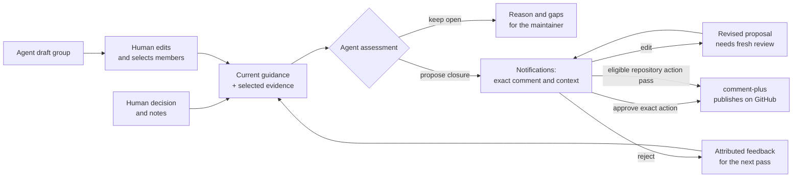
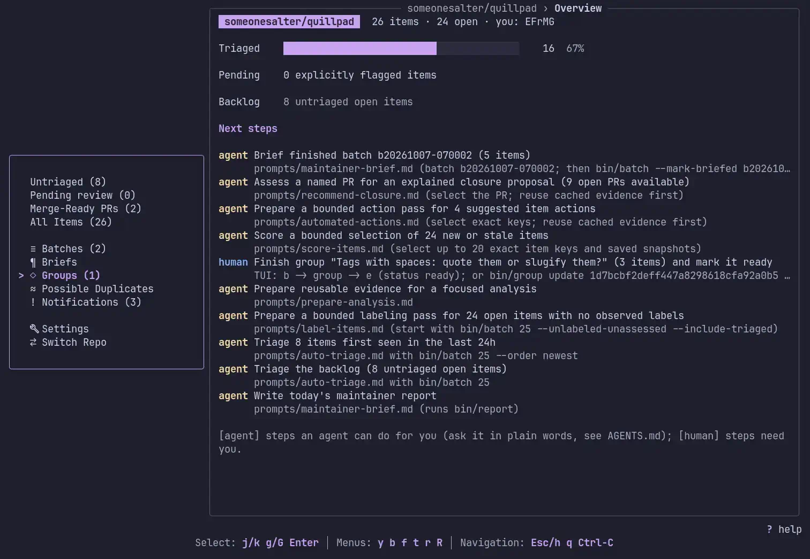
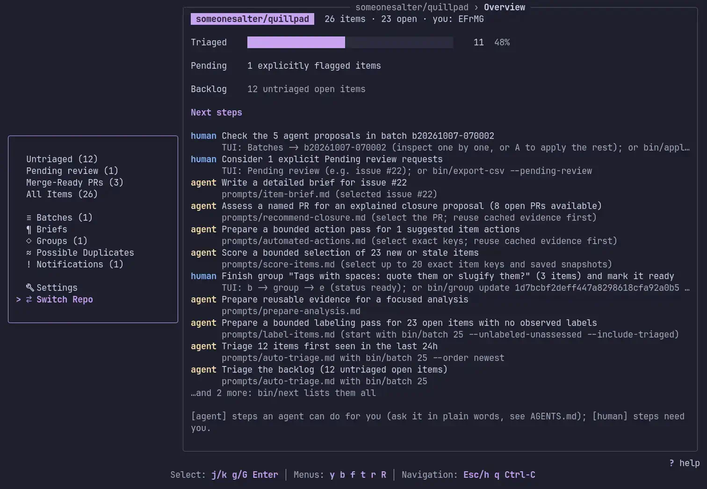
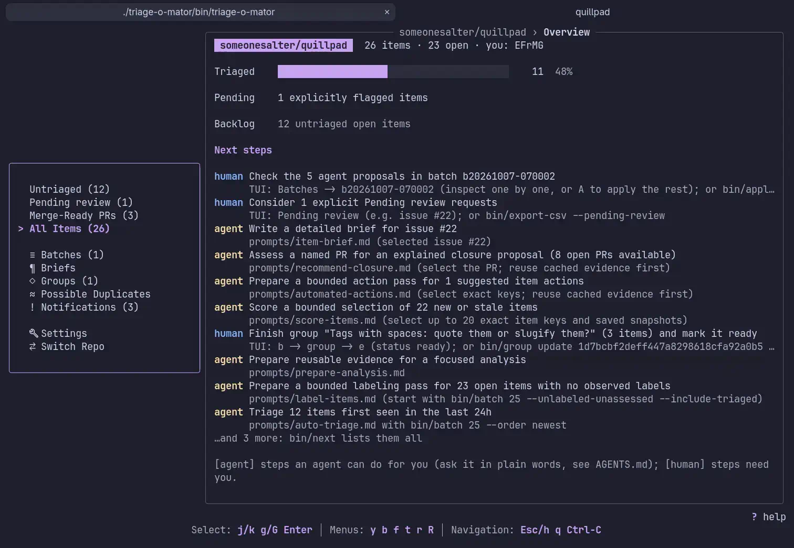

# triage-o-mator

Isn't it fun to contribute on GitHub?!

Well, it is not as productive when the Issues and Pull Requests pile up. Maintainers and reviewers need time to handle those, and so here we intend to provide a working solution to ameliorate the effort through correct organization.

## Brief

Tooling to work through a GitHub issue / PR backlog too large for one person to read cold: a terminal UI, `triage-o-mator`, on top of a set of small scripts that do the actual work.

The backlog gets a first pass of triage done in batches, by you or by an AI Agent. Triage decisions, Pending review requests and action proposals remain separate records.

It reads issues and PRs via `gh` and writes triage decisions to a local ledger. You can also compose and explicitly approve a GitHub comment, closure or reopening through the TUI; publishing defaults to dry-run and never follows automatically from a triage decision.

> Developed with the [omacom/omarchy](https://github.com/omacom/omarchy) backlog in mind, while supporting other GitHub repositories. Omarchy is a public proof-of-concept target, not an existing deployment.

You install it **into the repository you triage**: this checkout provides the program, while each target repository owns a `triage-o-mator/` directory with its ledger, groups, automated proposals, reports and taxonomy. Decisions, review requests and group guidance can travel through ordinary Git pull requests. Batches and evidence caches are local working data. A solo install keeps all of it out of the repository's history, for a repository you don't control.

## How it works

Three kinds of local record carry the work:

- The **ledger** has one row per issue or PR, holding its triage decision and any explicit Pending review request.
- **Groups** collect related items so maintainers can decide on them together.
- The **cache** keeps versioned GitHub data for offline analysis.

An agent reads the current guidance and evidence, then either explains why an item should stay open or saves an exact action proposal.


```mermaid
flowchart LR
    HUMAN["Human decision<br/>and notes"] --> CONTEXT["Current guidance<br/>+ selected evidence"]
    GROUP["Agent draft group"] --> EDIT["Human edits<br/>and selects members"] --> CONTEXT
    CONTEXT --> AGENT{"Agent assessment"}
    AGENT -->|"keep open"| OPEN["Reason and gaps<br/>for the maintainer"]
    AGENT -->|"propose closure"| NOTICE["Notifications:<br/>exact comment and context"]
    NOTICE -->|"edit"| REVIEW["Revised proposal<br/>needs fresh review"] --> NOTICE
    NOTICE -->|"reject"| FEEDBACK["Attributed feedback<br/>for the next pass"] --> CONTEXT
    NOTICE -->|"approve exact action"| WRITE["comment-plus<br/>publishes on GitHub"]
    NOTICE -->|"eligible repository action pass"| WRITE
```

A staged proposal appears in **Notifications** with its target, its exact comment, the human guidance it relied on and any gaps in its evidence.

A reviewer can:

- **edit** it, which calls for a fresh review;
- **reject** it, with an optional attributed reason that the next agent pass reads;
- **approve** the exact GitHub write.

A repository action pass, enabled separately, can also execute an eligible proposal after its own preview and rechecks. When the guidance changes, the proposal has to be prepared and reviewed again.

Three states never imply one another: a group marked `ready`, an item's Pending review request, and approval of a GitHub write.

An item enters the ledger the first time it is seen open; its row and decision history stay there even after it closes.

## Install

You need an authenticated [`gh`](https://cli.github.com/), [mise](https://mise.jdx.dev/) and [Python3](https://www.python.org/).

```sh
gh repo clone efrmg/triage-o-mator && cd triage-o-mator
./install.sh /path/to/your/repository # mise install, make build, bin/install-to

cd /path/to/your/repository
triage-o-mator/bin/triage-o-mator # And she's ON!
```

Every script finds its install from its own path, so commands work from the repository root or from inside `triage-o-mator/`.

The [installation guide](docs/install.md) covers solo installs, adoption, upgrades, and custom prompts and taxonomy.

## Walkthrough

The [tutorial](docs/tutorial.md) covers these menus and their keybindings in detail.

[Group review](docs/groups.md) and [cache evidence](docs/evidence.md) have guides of their own.

> The mouse works alongside the keyboard.

A usual session goes from the overview to reading and deciding on items, then to grouping and comparing them, reviewing what agents proposed, and handing the result to maintainers.

### Menus

They are listed here in sidebar order.

0. **Overview.** Get oriented: it shows the current repository, triage and review progress, and suggestions for what's up next. Refresh the issues and PRs that changed.

   

1. **Untriaged.** Open items that have no decision yet. Filter by issues or PRs, reverse the age order, search, or tick several items for one action.

   

2. **Pending review.** Items flagged for human attention. **Pending review** is a separate flag. An agent or a person sets it, with a short reason, when an item needs human attention, such as a consequential project decision or a public security disclosure. Saving a decision does not set it, and clearing it changes neither the decision nor any GitHub approval.

   

3. **Merge-Ready PRs.** Open PRs whose saved decision proposes the `ready` label with high confidence. It is a reading queue: the tool does not approve or merge PRs.

   

4. **All Items.** Every item in the ledger, open or closed. **All Items** lets a person revise any call.

   

5. **Batches.** An agent can prepare a whole batch from copied context: check its suggestions in **Batches**, then save them one by one or apply the rest as local decisions. A batch can be exported as a decision packet.

   

6. **Briefs.** An agent can screen successive batches into short briefs, write a [detailed item brief](prompts/item-brief.md), and [polish selected briefs](prompts/polish-briefs.md) into one master brief. Read them all under **Briefs**. A brief may justify a Pending review request, and screening alone flags nothing and approves nothing.

   

   

7. **Groups.** Create a **Group** of tangentially related items (or have an Agent do it); add more into it at any time. Edit its description and individual member notes to keep the team well aligned. Agents can prepare recommendations for each `y`anked group. Marking a checked group `ready` hands it to maintainers (without approving GitHub actions). A group can be exported as a decision packet too.

   

8. **Possible Duplicates.** It offers lookalike pairs and a way of marking true duplicates. Compare both sides, then record the duplicate or rule the pair out so it is not offered again.

   

9. **Notifications.** Review proposals and follow new comments. A PR closure proposal shows its explanatory comment, the relevant human guidance, earlier objections and the gaps in its selected evidence (if any). Approve it, edit it, or reject it with an optional reason. An edit needs a fresh review; a rejection stays in shared history for the next agent pass. The same menu tracks issue and PR comments, and separates items needing attention from past activity. Viewing or dismissing a row confirms no appeal and clears no Pending review request.

   

10. **Settings.** **Labels** edits the repository's GitHub labels, each change previewed before it is written. **Actions** edits the local list of actions a decision can suggest, with guidance for each. **Automations** decides what a bounded pass may do without asking again:
    - Labeling is ON by default. Its pass applies proposed labels whatever the suggested action or Pending review state, and runs only when an agent or a person asks for it.
    - Each action type stages its proposals for approval in Notifications, unless you set it to execute directly.
    - A hold, OFF by default, keeps Pending review items staged even then.

    

11. **Switch Repo.** Each repository has its own taxonomy, ledger, batches, groups, exports and reports. The TUI asks about unsaved drafts before switching, and ignores replies that arrive late from the previous repository.

    

### On any screen

These work the same wherever an item or a list is in front of you.

- **Read an item and save a decision.** An item shows its body, agent notes, comments and, for a PR, the diff. Set labels, suggest an action, and give a short reason and a confidence. A label-first pass can leave Action blank.

  

- **Copy context for an Agent.** Most screens can copy a short handoff for an Agent: `y` for the item or the ticked ones, `Y` for the whole list, batch or group.

  

- **Build the local dataset.** Press `f`, then turn automatic download **ON**. It freezes the list of open items and downloads their descriptions, discussions, PR files, diffs and closing links, now and again after each startup or backlog refresh. An agent can then search the saved evidence, and earlier saved observations, instead of fetching from GitHub item by item, which is slower and fills its context with data it does not need. Missing, partial or old evidence stays registered.

  

- **Publish a GitHub action.** Compose a comment, or close or reopen an item with a comment that explains why. A bulk action shows every target before publishing, and an uncertain result stops the remaining ones for inspection.

  

- **Report to maintainers.** `bin/report` gathers ready groups, Pending review requests and suggested actions into a dated Markdown report.

## Working from a fork

An install can live in a fork while reading the upstream backlog. From this built checkout, for example:

```sh
bin/install-to /path/to/your/omarchy --repo omacom/omarchy
```

The local clone can be your fork; `--repo` chooses whose issues and PRs to read. Browsing and preparing proposals needs no upstream write access; publishing there does. See the [fork walkthrough](docs/install.md#working-from-a-fork) for tracked and solo work.

## Reference

Paths below are relative to an install, such as `data/<owner>/<repo>/ledger.jsonl`.

### Local records

A ledger row keeps the labels observed on GitHub apart from the labels proposed locally. It also records the recommended action, confidence and reason, who triaged the item, and optional agent and maintainer notes. An optional `review_request` says why the item needs human attention; [the playbook](prompts/PLAYBOOK.md#explicit-pending-review) explains it.

Each install owns its [taxonomy.json](config/taxonomy.json); the [taxonomy guidance](docs/taxonomy.md) explains how to use it.

The ledger and other transactional records are replaced atomically; reports and CSV exports are not. See [local storage and recovery](docs/storage.md).

### Scripts

These run from an install in the repository being triaged. Some examples:

```sh
bin/fetch && bin/sync
bin/stats
bin/batch 25
bin/batch 25 --include-triaged --unbriefed --order updated
bin/apply data/<owner>/<repo>/batches/<id>.decisions.jsonl --only-untriaged
bin/report
bin/briefs list
bin/briefs plan --all
```

| Task                                            | Commands                                                                                            |
| ----------------------------------------------- | --------------------------------------------------------------------------------------------------- |
| Install and refresh                             | `bin/install-to`, `bin/label-catalog`, `bin/fetch`, `bin/sync`                                      |
| Prepare and edit decisions                      | `bin/batch`, `bin/read-batch`, `bin/apply`, `bin/export-csv`, `bin/import-csv`                      |
| Flag items for human attention                  | `bin/review-request`                                                                                |
| Compare and group                               | `bin/similar`, `bin/duplicate-assessment`, `bin/not-duplicate`, `bin/group`, `bin/group-assessment` |
| Read guidance and evidence                      | `bin/item-context`, `bin/cache`, `bin/enrich-one`, `bin/reposition-env`                             |
| Edit action settings                            | `bin/taxonomy-settings`, `bin/action-policy`                                                        |
| Preview, initialize and reconcile GitHub labels | `bin/label-definitions`                                                                             |
| Record no-fit assessments and apply labels      | `bin/label-assessment`, `bin/item-labels`                                                           |
| Assess, propose and publish actions             | `bin/action-assessment`, `bin/action-proposals`, `bin/action-pass`, `bin/comment-plus`              |
| Score and review selected issues and PRs        | `bin/item-score`, `bin/pr-assessment`                                                               |
| See progress and handoffs                       | `bin/stats`, `bin/next`, `bin/report`, `bin/briefs`                                                 |

#### Briefs from the command line

**Screen a batch.** After screening a whole batch, save its dated brief and record the checkpoint:

```sh
bin/batch --mark-briefed ID --brief PATH
```

The next `--unbriefed` pass then skips every member of that batch, including the ones the brief did not feature. A brief may say that nothing needed a maintainer call. `bin/next` suggests the next pass or [polishing selected briefs](prompts/polish-briefs.md); it runs neither.

**Plan a master brief.** Choose the batch briefs it will draw from:

```sh
bin/briefs plan --all                     # every visible batch brief
bin/briefs plan --all --include-read      # also the ones marked read in the TUI
bin/briefs plan --brief A.md --brief B.md # an exact set
```

The plan returns the selected brief paths, their content digests, a plan checksum and a size target for the master brief.

**Record the master.** After writing it, save the exact inputs and content revisions it was built from in a tracked record:

```sh
bin/briefs --expected-repo OWNER/REPO record-master --master NAME.md --brief SOURCE.md ... --plan-sha256 HASH --by agent:NAME
```

**Mark a brief read.** `bin/briefs mark-read NAME.md` previews a rename to `NAME_READ.md`. Apply it with the checksum from that preview:

```sh
bin/briefs --expected-repo OWNER/REPO mark-read NAME.md --apply --preview-sha256 HASH
```

The Markdown stays on disk, unchanged, and leaves the TUI menus. Pending review and GitHub state are untouched.

#### Further guides

- The [evidence reference](docs/evidence-reference.md), [group guide](docs/groups.md), [comment publishing guide](docs/comment-plus.md) and [item score guide](docs/item-score.md) cover the commands and their limits.
- Closed-PR [watches](docs/appeal-evidence.md) and [external closure records](docs/external-closures.md) have separate guides.
- [Bounded evidence readers](docs/evidence-reference.md#bounded-offline-snapshot-readers) expose selected snapshots and their gaps without filling missing data from GitHub. The [agent preparation prompt](prompts/prepare-analysis.md) starts from saved evidence and asks for a focused source review before any recommendation.
- [The Reposition bridge](docs/reposition.md) adds optional ranked queries over the cache and verified fragment retrieval, all offline. Turning automatic download ON installs it from the checked-in, verified wheel without contacting upstream Reposition; if setup fails, the native cache and literal search still work. Ranked results are leads, separate from duplicate decisions and approved actions.

## Prompts

[`prompts/PLAYBOOK.md`](prompts/PLAYBOOK.md) is linked into each install as its agent instructions. Ask in plain words; the matching task prompt says what to read and what may be saved.

| Ask                                             | Prompt                                                                                            | Result                                      |
| ----------------------------------------------- | ------------------------------------------------------------------------------------------------- | ------------------------------------------- |
| “triage 25 issues”                              | [Auto triage](prompts/auto-triage.md)                                                             | Attributed local batch decisions            |
| “label the backlog”                             | [Label items](prompts/label-items.md)                                                             | Bounded proposed-label pass                 |
| “run an action pass”                            | [Automated actions](prompts/automated-actions.md)                                                 | Staged proposals or recorded write outcomes |
| “prepare offline analysis”                      | [Prepare analysis](prompts/prepare-analysis.md)                                                   | A scoped cache handoff with gaps            |
| “is #N a duplicate?”                            | [Find duplicates](prompts/find-duplicates.md)                                                     | A sourced comparison or proposal            |
| “review PR #N”                                  | [Review PR](prompts/review-pr.md)                                                                 | Code review notes and a local decision      |
| “recommend PR closures”                         | [Recommend PR closures](prompts/recommend-closure.md)                                             | Pending, unapproved PR closure proposals    |
| “organize these items”                          | [Organize groups](prompts/organize-groups.md)                                                     | Draft maintainer groups                     |
| “assess this edited group”                      | [Organize groups](prompts/organize-groups.md#after-review-prepare-proposals-for-selected-members) | Scoped proposals or keep-open reasons       |
| “review an appeal”                              | [Review appeal](prompts/review-appeal.md)                                                         | An attributed local reassessment            |
| “brief the maintainers” or “polish the report”  | [Maintainer brief](prompts/maintainer-brief.md)                                                   | A short overview or focused decision brief  |
| “brief issue #N” or “brief PR #N”               | [Item brief](prompts/item-brief.md)                                                               | A detailed case and recommendation          |
| “polish these briefs” or “write a master brief” | [Polish briefs](prompts/polish-briefs.md)                                                         | A short synthesis of selected briefs        |
| “score these items” or “run a scoring pass”     | [Score selected items](prompts/score-items.md)                                                    | A bounded, source-bound quality score       |

> [!IMPORTANT]
> Agents save attributed local decisions. Pending review is an explicit request for attention. Bounded passes, enabled per repository, can separately apply labels or execute eligible actions.

On a large backlog, run each playbook over one bounded selection at a time. What carries a pass forward depends on the playbook:

- Triage advances through untriaged batches.
- Maintainer briefing records a durable checkpoint for each screened batch.
- Labeling records an outcome per item, and scoring stores a score bound to the item's revision.
- Duplicate comparison, code review, closure recommendation and action preparation need a handoff that names the exact keys completed and the keys remaining.

Candidate lists and `bin/next` counts do not show that the whole backlog was covered.

### Working as a team

Agents propose decisions and draft groups, contributors review them and mark groups ready, and lead maintainers read the brief. The ledger and groups travel through the repository's normal Git workflow. See the [team conventions](prompts/PLAYBOOK.md#working-as-a-team) and the [installation guide](docs/install.md#working-as-a-team-through-it) for setup and coordination.

### Notes on security

> [!WARNING]
> This is a very important issue: we are fetching text from unfiltered users on GitHub.

During testing, Claude flagged some of the fetched data as a **potential injection risk**.

The capture shows it reading a batch, tripping an internal flag, reasoning about it (who knows how) and then writing the review anyway. So even when the fail-safe activates, the agent may keep going.


I have a solid way to reduce risks using a VM on [my blog post](https://francisco.is-a.dev/en/blog/arch-vm).

## Development

Use `mise exec -- make check` for the Go and Python checks, and `mise exec -- make build` for the TUI.

See [AGENTS.md](AGENTS.md) for repository conventions.

## Not Built (yet)

- **Other GitHub write actions**: the tool does not approve or merge PRs. See [comment publishing](docs/comment-plus.md) and [item labeling](docs/install.md#automations-and-item-labeling).
- **Automatic appeal monitoring**: closed-PR watches need explicit enrollment and polling after the ledger baseline; closed issues have no watch yet.
- **Live shared use**: a team shares decisions, review requests and groups by committing them through Git. Installs do not sync with each other online, so nobody sees a colleague's work until it is pushed and pulled.
