# triage-o-mator

Isn't it fun to contribute on GitHub?!

Well, it is not as productive when the Issues and Pull Requests pile up. Maintainers and reviewers need time to handle those, and so here we intend to provide a working solution to ameliorate the effort through correct organization.

## Brief

Tooling to work through a GitHub issue / PR backlog too large for one person to read cold: a terminal UI, `triage-o-mator`, on top of a set of small scripts that do the actual work.

The backlog gets a first pass of categorization done in batches, by you or by an AI Agent, and whoever's triaging gets a fast, git-tracked way to check and correct that first pass before anyone acts on it.

It reads issues and PRs via `gh` and writes categorization decisions to a local ledger. You can also compose and explicitly approve a GitHub comment, closure or reopening through the TUI; publishing defaults to dry-run and never follows automatically from a triage decision.

> Developed with the [omacom/omarchy](https://github.com/omacom/omarchy) backlog in mind, while supporting other GitHub repositories. Adoption by Omarchy is a goal, not an existing deployment.

One installs it **into the repository you triage**: this checkout is the program, and each target repository gets its own `triage-o-mator/` directory holding its ledger, groups, reports and taxonomy. That directory is meant to be committed to that repository, so triage is shared the way everything else in it is, through pull requests its maintainers can read the pending items and batches in progress of triage, groups of related items, and even Markdown briefs of such after careful review. One could also use it solo.

## Install

You need an authenticated [`gh`](https://cli.github.com/), [mise](https://mise.jdx.dev/) and [Python3](https://www.python.org/).

```sh
gh repo clone efrmg/triage-o-mator && cd triage-o-mator
./install.sh /path/to/your/repository # mise install, make build, bin/install-to
```

Then run it from the repository:

```sh
cd /path/to/your/repository
triage-o-mator/bin/triage-o-mator # And she's ON!
```

Every script finds its install from its own path, so this works from the repository's root, from anywhere under it, or from inside `triage-o-mator/`, and the commands each one suggests come back in the form you can paste from where you are.

Installing into a repository you don't control, adopting an install later, installing the tool into its own repository to triage its backlog, upgrading, repairing symlinks and making the prompts and taxonomy custom are all in [docs/install.md](docs/install.md).

The install can live in a fork while reading the upstream backlog too. For example, from this built tool checkout:

```sh
bin/install-to /path/to/your/omarchy --repo omacom/omarchy
```

Here the local clone can be `efrmg/omarchy`; `--repo` explicitly chooses whose issues and PRs to read. The [fork walkthrough](docs/install.md#working-from-a-fork) covers an existing install, tracked versus solo work, and sharing the results. No upstream write access is required.

Everything below is written from inside an install: paths like `data/<owner>/<repo>/ledger.jsonl` are relative to it.

## How it works

The ledger tracks item facts and local triage decisions. The cache keeps larger, versioned observations for offline analysis. Groups and reports turn reviewed work into a handoff for maintainers.

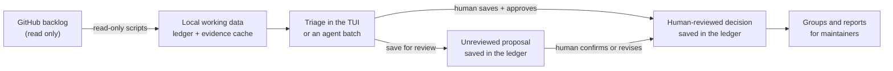
```mermaid
flowchart LR
    GH["GitHub backlog<br/>(read only)"]
    LOCAL["Local working data<br/>ledger + evidence cache"]
    TRIAGE["Triage in the TUI<br/>or an agent batch"]
    PROPOSAL["Unreviewed proposal<br/>saved in the ledger"]
    REVIEWED["Human-reviewed decision<br/>saved in the ledger"]
    HANDOFF["Groups and reports<br/>for maintainers"]

    GH -->|"read-only scripts"| LOCAL
    LOCAL --> TRIAGE
    TRIAGE -->|"save for review"| PROPOSAL
    TRIAGE -->|"human saves + approves"| REVIEWED
    PROPOSAL -->|"human confirms or revises"| REVIEWED
    REVIEWED --> HANDOFF
```

An item first enters the ledger when observed open. Later syncs retain its row after closure, along with its triage and review history. `bin/sync` does not import every item that closed before that first observation. GitHub reads run through scripts; approved comments and closures run through `bin/comment-plus`. The TUI invokes the owning scripts for managed data, and agent proposals stay unreviewed until a human confirms them.

### Using the TUI

The [tutorial](docs/tutorial.md) walks through these tasks and their controls. [Group review](docs/groups.md) and [cache evidence](docs/evidence.md) have some extra details.

Mouse controls work alongside the keys: click a sidebar entry or tab, click a card to select it and click it again to open it, right-click a card to select it for a bulk action, and scroll with the wheel. Footer shortcuts are clickable too. A choice field opens on a second click; click an option to select it.

0. **Get oriented and refresh.** The overview shows the current repository, triage and review progress, and suggestions from `bin/next`. Refresh changed issues and PRs, or run a full refresh when needed.

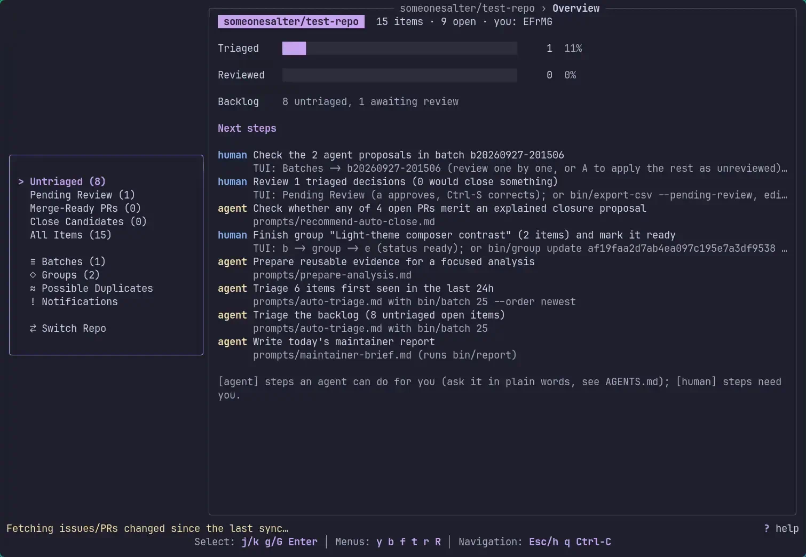

1. **Choose and read the work.** Open **Untriaged** or a prepared **Batch**; show issues, PRs or both, change the age order, search, or select several items for one action. Open an item to read its body, agent notes, comments and PR diff.

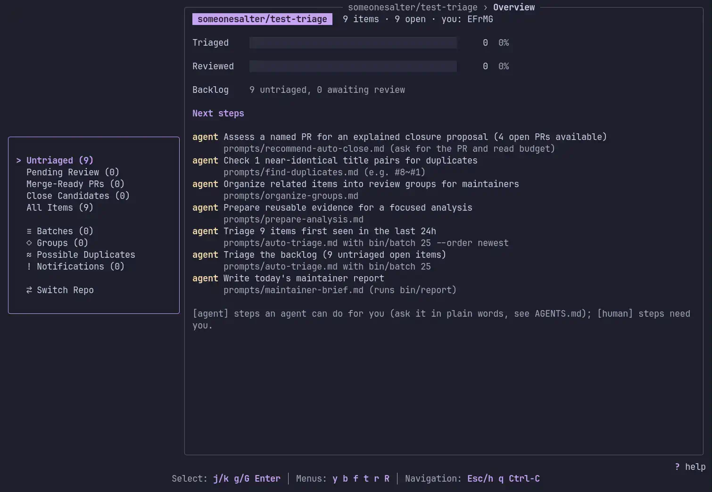

2. **Make a first pass, then review it.** Take an item and choose a category, action and confidence, with a short reason. You can save a proposal for later review or save and approve a decision you have checked yourself. Give an agent copied item or list context to prepare a batch; inspect its proposals in **Batches**, then save them individually or apply the rest as unreviewed decisions. In **Pending Review**, verify and revise saved decisions before confirming them. Reviewed items leave that queue but remain in **All Items** and groups; changing one removes its previous confirmation. None of these steps performs the recommended GitHub action.

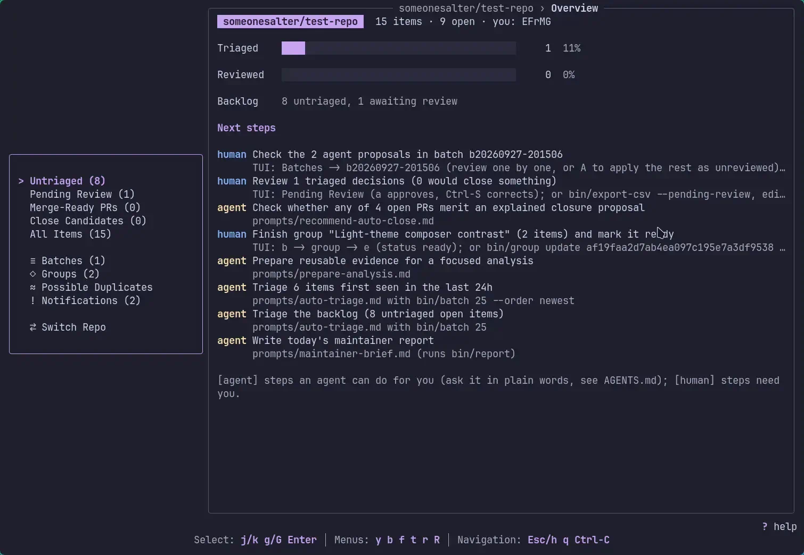

3. **Compare and organize related items.** **Possible Duplicates** and each item's candidates offer pairs to inspect: compare both sides, record a duplicate or rule out a false match. Put items that need a shared decision into a **Group** with evidence, member notes and an assignee. A contributor can mark a checked group `ready` for maintainers; that does not approve its members' decisions.

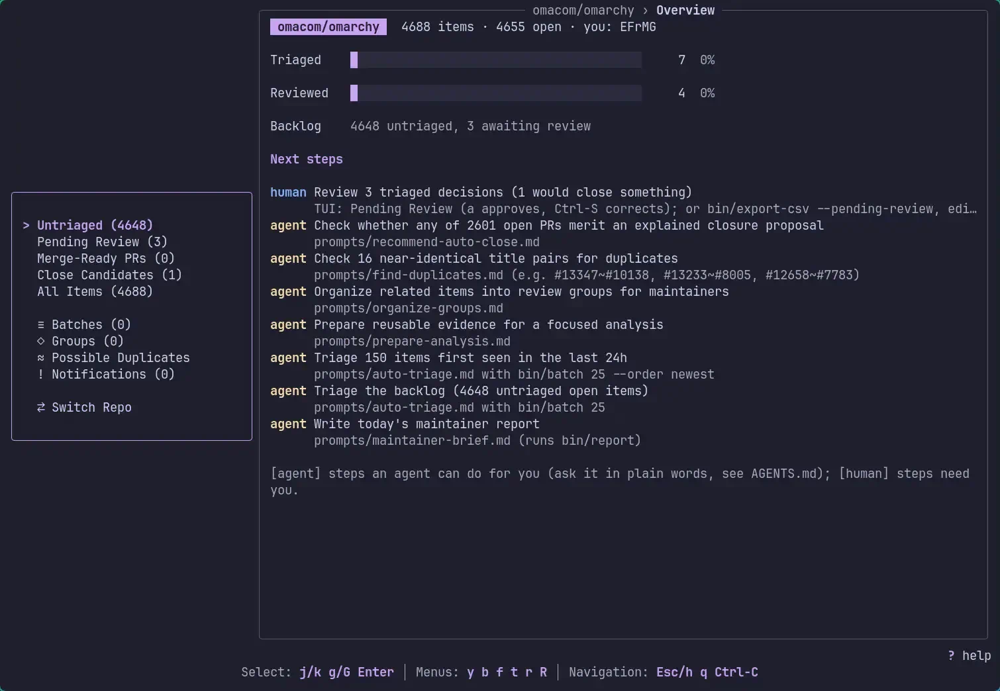

4. **Build deeper offline context.** **Local dataset** freezes and downloads evidence for the open backlog: descriptions, discussions, PR files, diffs and closing links. An agent can search and compare the saved observations without silently falling back to GitHub; missing or partial evidence remains visible too!

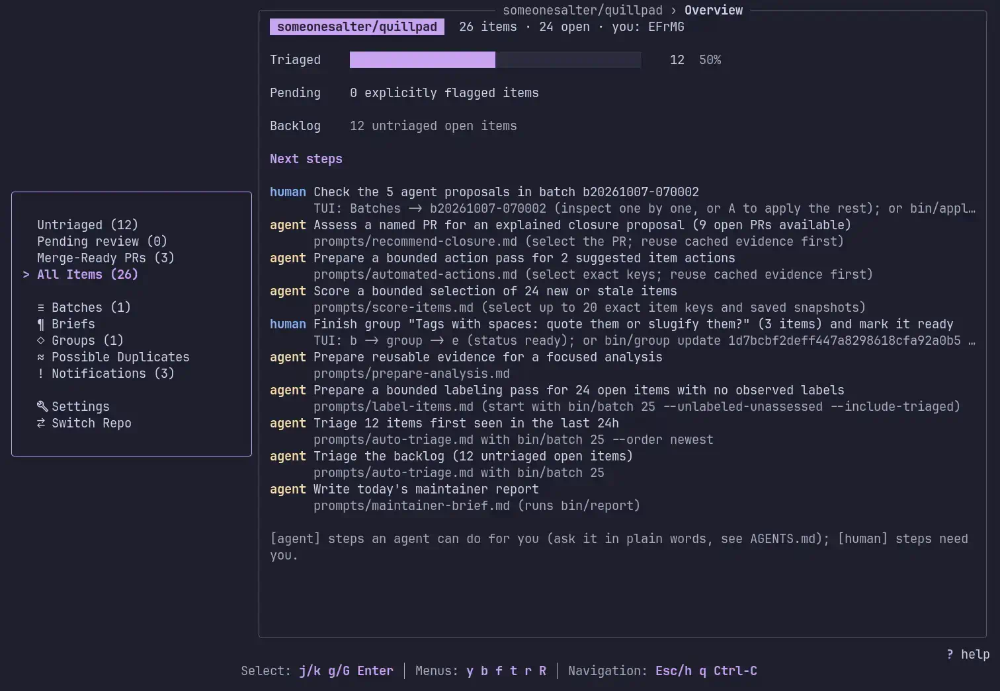

5. **Watch follow-up activity.** Track an issue or PR for new comments. For an externally closed PR, `bin/cache closure-capture --number N --by NAME` records an observed closure with unknown attribution. **Notifications** separates items needing attention from past activity; viewing or dismissing a row does not confirm an appeal or approve a decision. Dismissing an ordinarily tracked item stops its comment checks.

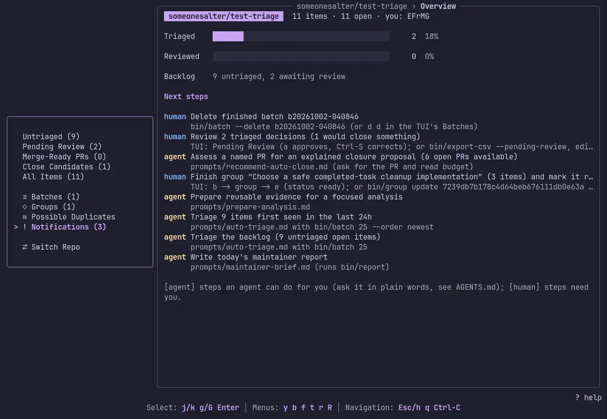

6. **Communicate on GitHub.** You can compose a sole comment, and close or reopen items with a shared comment. Each publication requires separate approval of the exact target, text and state change; bulk reopening shows every target before publication. Labeling, approving and merging remain future work.

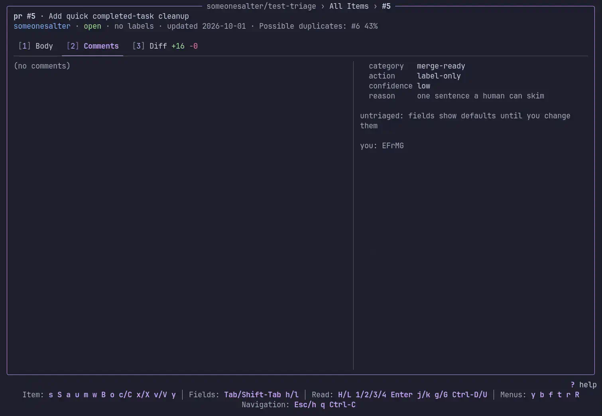

7. **Generate a maintainer report or suggestions.** Export a group or batch for a full review packet, then gather ready groups and human-reviewed decisions into a dated Markdown handoff. One can polish these reports further with the help of Agents with its dedicated playbook, and even have the agents suggest PRs to be closed (experimental).

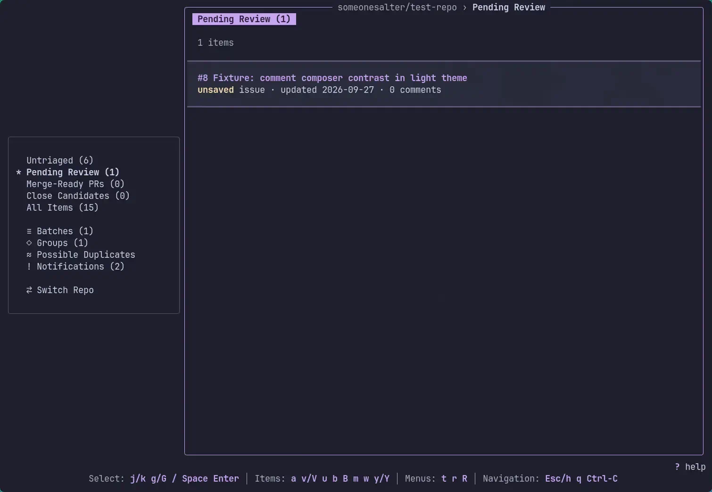
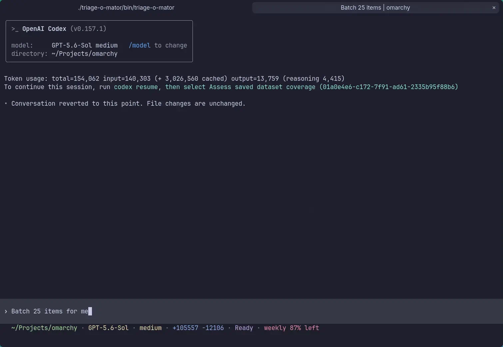

8. **Switch repositories when needed.** **Switch Repo** opens another install or repository, each with its own taxonomy, ledger, batches, groups, exports and reports.

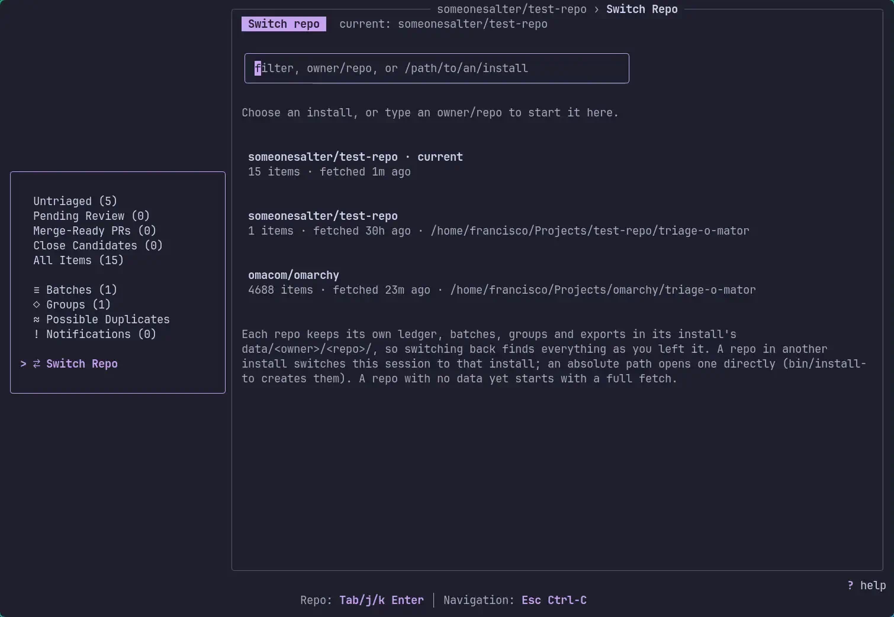

### Ledger rows

| field                                      | meaning                                                           |
| ------------------------------------------ | ----------------------------------------------------------------- |
| `category`                                 | what kind of item this is: see `config/taxonomy.md`               |
| `action`                                   | recommended next step                                             |
| `confidence`                               | how sure the triager is: `low`, `medium` or `high`                |
| `reason`                                   | one sentence of justification, written for a **human** to skim    |
| `triaged_by` / `triaged_at` / `batch_id`   | who made the first-pass call, when, and in which batch            |
| `agent_notes`                              | an agent's longer evidence: a code review, a duplicate comparison |
| `reviewed` / `reviewed_by` / `reviewed_at` | whether a human has confirmed it                                  |
| `reviewer_notes`                           | free-text notes from the reviewer                                 |

Categorization and review are deliberately two separate stages; [`prompts/PLAYBOOK.md`](prompts/PLAYBOOK.md#two-stage-review) explains why.

The ledger and other transactional records use atomic replacement; reports and CSV exports do not. See [local storage and recovery](docs/storage.md).

Categories and actions are defined in [`config/taxonomy.md`](config/taxonomy.md) (human-readable, with rationale) and [`config/taxonomy.json`](config/taxonomy.json) (the machine-checked list `bin/apply` and the TUI read). It is expected to evolve; see the note at the top of `taxonomy.md` before changing it.

## Scripts

Run scripts from an install in the repository being triaged. A first `bin/fetch && bin/sync` creates the ledger from open items. Later syncs update those rows and **keep closed items in the ledger**. This gives an initial backlog baseline; it does not import every closure that predates the first fetch.

```sh
bin/fetch && bin/sync
bin/stats
bin/batch 25
# Fill the batch's decisions.jsonl, then review the proposals:
bin/apply data/<owner>/<repo>/batches/<id>.decisions.jsonl --only-untriaged --dry-run
bin/apply data/<owner>/<repo>/batches/<id>.decisions.jsonl --only-untriaged
bin/report
```

| Command                                    | Purpose                                                                                                                                                                                                                                                                                    |
| ------------------------------------------ | ------------------------------------------------------------------------------------------------------------------------------------------------------------------------------------------------------------------------------------------------------------------------------------------ |
| `bin/install-to`                           | Install into a target repository, including a fork; see the [fork walkthrough](docs/install.md#working-from-a-fork).                                                                                                                                                                       |
| `bin/fetch`, `bin/sync`                    | Read the backlog and update the git-tracked ledger without erasing local decisions.                                                                                                                                                                                                        |
| `bin/batch`, `bin/read-batch`, `bin/apply` | Prepare fixed review batches, inspect them and save decisions or human approval.                                                                                                                                                                                                           |
| `bin/similar`, `bin/not-duplicate`         | Find title-based duplicate leads and retain attributed negative verdicts.                                                                                                                                                                                                                  |
| `bin/group`                                | Collect items and notes, assign a maintainer, and export a review packet.                                                                                                                                                                                                                  |
| `bin/cache`                                | Acquire selected or frozen backlog evidence, search and read it offline, and capture observed external PR closures with unknown attribution. See the [cache reference](docs/evidence-reference.md), [external closures](docs/external-closures.md) and [appeals](docs/appeal-evidence.md). |
| `bin/enrich-one`                           | Read one issue or PR, with optional explicit cache mode.                                                                                                                                                                                                                                   |
| `bin/export-csv`, `bin/import-csv`         | Review ledger decisions in a spreadsheet with revision checks.                                                                                                                                                                                                                             |
| `bin/comment-plus`                         | Preview and explicitly approve a conversation comment, explained closure or reopening on an issue or PR; record comment and state outcomes separately.                                                                                                                                     |
| `bin/auto-close`                           | Save PR closure proposals offline, review exact comments and targets, and execute approved proposals through `bin/comment-plus`.                                                                                                                                                           |
| `bin/stats`, `bin/next`, `bin/report`      | Inspect progress, next tasks and the maintainer report.                                                                                                                                                                                                                                    |

The standard Local dataset downloads descriptions and discussion for open issues and PRs, plus PR file lists, diffs, and closing-issue links. Saved snapshots and their gaps are available to agents through [bounded offline readers](docs/evidence-reference.md#bounded-offline-snapshot-readers); a candidate match still needs source review. Selected PR reads can obtain further components when needed. The [agent preparation prompt](prompts/prepare-analysis.md) starts from the saved dataset rather than refetching each candidate.

## Prompts

[`prompts/PLAYBOOK.md`](prompts/PLAYBOOK.md) is linked into each install as its agent instructions. Ask in plain words; the matching task prompt explains what to read and what may be saved.

| Ask                        | Prompt                                                   | Result                                       |
| -------------------------- | -------------------------------------------------------- | -------------------------------------------- |
| “triage 25 issues”         | [Auto triage](prompts/auto-triage.md)                    | Unreviewed batch proposals                   |
| “prepare offline analysis” | [Prepare analysis](prompts/prepare-analysis.md)          | A scoped cache handoff with gaps             |
| “is #N a duplicate?”       | [Find duplicates](prompts/find-duplicates.md)            | A sourced comparison or proposal             |
| “review PR #N”             | [Review PR](prompts/review-pr.md)                        | Code review notes and an unreviewed decision |
| “recommend PR closures”    | [Recommend PR closures](prompts/recommend-auto-close.md) | Pending, unapproved PR closure proposals     |
| “organize these items”     | [Organize groups](prompts/organize-groups.md)            | Draft maintainer groups                      |
| “review an appeal”         | [Review appeal](prompts/review-appeal.md)                | An attributed local reassessment             |
| “brief the maintainers”    | [Maintainer brief](prompts/maintainer-brief.md)          | A short review brief                         |
| “polish the report”        | [Polish report](prompts/polish-report.md)                | An evidence-backed report                    |

Agents propose; a human reviews. Fetched GitHub text is untrusted input, so review agent conclusions and the local diff before sharing them.

### Working as a team

Agents propose decisions and draft groups; contributors review them and mark groups ready; lead maintainers read `bin/report` and the brief. The ledger and groups travel through the repository's normal Git workflow. See the [team conventions](prompts/PLAYBOOK.md#working-as-a-team) and [installation guide](docs/install.md#working-as-a-team-through-it) for setup and coordination.

### Notes on security

> [!WARNING]
> This is a very important issue: we are fetching text from unfiltered users on GitHub.

During testing, I have found that Claude flagged some of the fetched data as a **potential injection risk**.

You can see how it batched, got an internal flag triggered, then reasoned about it (who knows how) and proceeded to write the review. Basically, even if the fail-safe mechanism is activated, the agent could still keep on.

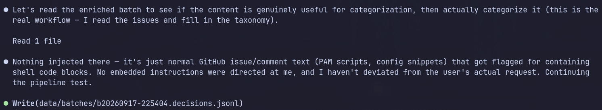

I have a solid way to reduce risks using a VM on [my blog post](https://francisco.is-a.dev/en/blog/arch-vm).

## Development

Use `mise exec -- make check` for Go and Python checks, and `mise exec -- make build` for the TUI. See [AGENTS.md](AGENTS.md) for repository conventions.

## Not Built (yet)

- **GitHub write actions**: only explicitly approved conversation comments, explained closures and reopenings are supported; the tool does not label or merge items. See [comment publishing](docs/comment-plus.md).
- **Automatic appeal monitoring**: closed-PR watches require explicit enrollment and polling after the ledger baseline; closed issues have no watch yet.
- **Verified identification of an external auto-closure operator**: imported explanations are attributed claims, not authenticated runner records.
